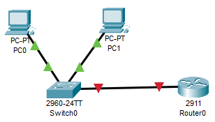
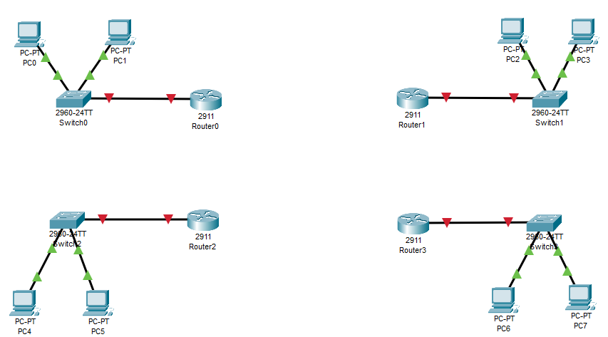
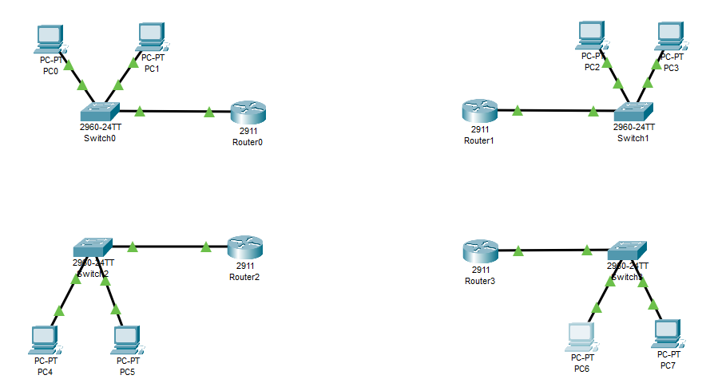
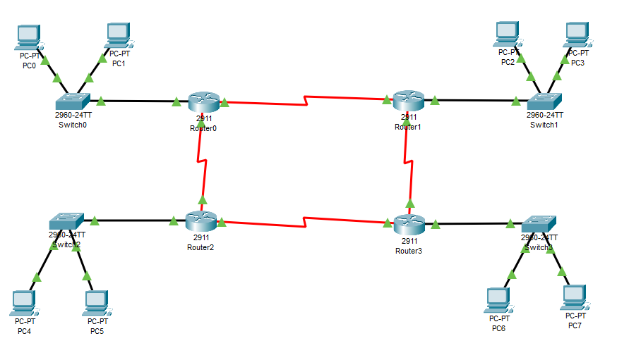
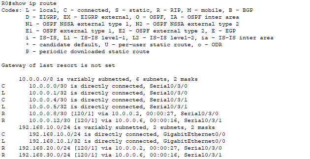
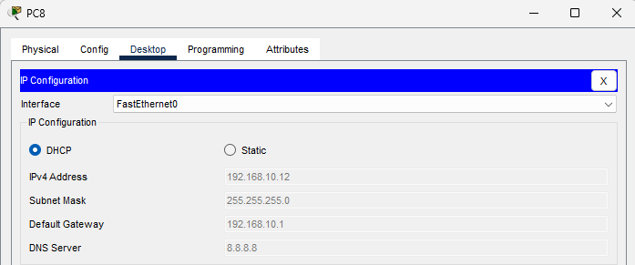
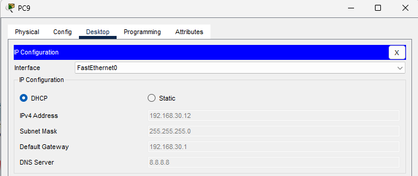

# Лабораторная работа №1
## Тема: Динамическая маршрутизация, DHCP и IPv6

**Вариант:** 4 (RIPv2)

---

## Цель работы

1. Освоить принципы **динамической маршрутизации** в компьютерных сетях.
2. Изучить настройку **протокола RIPv2** на маршрутизаторах Cisco.
3. Настроить и протестировать **DHCP-сервер** в локальной сети.
4. Получить практические навыки конфигурации **статической маршрутизации с IPv6**.

---

## Задачи

### **Задание А. Динамическая маршрутизация и DHCP**

1. Построить топологию сети, состоящую из:
    - четырёх маршрутизаторов;
    - четырёх коммутаторов;
    - минимум двух ПК в каждой локальной сети.
2. Настроить адресацию IPv4 для всех устройств сети.
3. Настроить протокол динамической маршрутизации **RIPv2** между всеми маршрутизаторами:
    - включить версию 2 (`version 2`);
    - отключить автообъединение подсетей (`no auto-summary`);
    - добавить соответствующие сети (`network ...`).
4. Включить DHCP-сервер на двух маршрутизаторах:
    - создать пулы IP-адресов для локальных сетей;
    - указать шлюз и DNS-сервер;
    - исключить адреса, выданные вручную (через `ip dhcp excluded-address`).
5. Проверить работу DHCP:
    - подключить новые ПК к соответствующим коммутаторам;
    - убедиться, что они автоматически получают IP-адрес и шлюз;
    - протестировать связь между всеми сегментами сети с помощью команды `ping`.

---

### **Задание Б. Статическая маршрутизация с IPv6**

1. Построить топологию из трёх маршрутизаторов, трёх коммутаторов и минимум двух ПК в каждой сети.
2. Назначить каждому интерфейсу маршрутизатора уникальный IPv6-адрес в разных подсетях.
3. Включить поддержку IPv6 на маршрутизаторах.
4. Настроить **статические маршруты** между всеми сетями:
    - указать подсеть назначения и следующий узел;
    - проверить таблицу маршрутизации (`show ipv6 route`).
5. Проверить работоспособность сети:
    - с ПК одной сети отправить `ping` на устройства другой;
    - убедиться в корректной передаче пакетов и двусторонней связи.

---

## Теоретические основы

### 1. Маршрутизация в сетях
**Маршрутизация** — процесс выбора пути для передачи пакетов между узлами сети.  
Различают:
- **Статическую маршрутизацию** — маршруты задаются вручную администратором.
- **Динамическую маршрутизацию** — маршруты обновляются автоматически с помощью протоколов обмена маршрутной информацией (RIP, OSPF, EIGRP, BGP и др.).

---

### 2. Протокол RIPv2

**RIP (Routing Information Protocol)** — один из старейших протоколов динамической маршрутизации, работающий по алгоритму **вектор расстояний**.  
Каждый маршрутизатор периодически обменивается таблицами маршрутов с соседями, передавая:
- сеть назначения,
- метрику (число переходов),
- адрес следующего узла (next hop).

**Особенности RIPv2:**
- Использует **UDP порт 520**.
- Поддерживает **CIDR и маски подсетей**.
- Максимальное количество переходов — **15**.
- Интервал обновления таблиц — **30 секунд**.
- Может использовать **аутентификацию маршрутов**.

**Пример настройки RIPv2 на Cisco:**
```
router rip
 version 2
 no auto-summary
 network 192.168.10.0
 network 192.168.20.0
 network 10.0.0.0
```

---

### 3. DHCP (Dynamic Host Configuration Protocol)

Протокол **DHCP** обеспечивает автоматическую выдачу сетевых параметров клиентам: IP-адрес, маска, шлюз, DNS-сервер.

**Основные этапы работы:**
1. **Discover** — клиент ищет DHCP-сервер.
2. **Offer** — сервер предлагает параметры.
3. **Request** — клиент запрашивает подтверждение.
4. **Acknowledge** — сервер подтверждает выдачу.

**Пример настройки DHCP на Cisco:**
```
ip dhcp excluded-address 192.168.1.1 192.168.1.10
ip dhcp pool LAN1
 network 192.168.1.0 255.255.255.0
 default-router 192.168.1.1
 dns-server 8.8.8.8
```

---

### 4. IPv6 и статическая маршрутизация

**IPv6** — современная версия IP-протокола с 128-битной адресацией.  
Пример адреса: `2001:0db8:acad:0001::1/64`

**Пример настройки маршрута вручную:**
```
ipv6 route 2001:db8:acad:2::/64 2001:db8:acad:1::2
```

**Включение IPv6 на маршрутизаторе:**
```
ipv6 unicast-routing
```

---
    
## Ход выполнения работы

---

### Задание А — Динамическая маршрутизация (RIPv2) и DHCP

### Шаг A.1 — Построение топологии сети

Создаём структуру локальных сетей, каждая из которых содержит:
- два персональных компьютера;
- один коммутатор Cisco 2960;
- один маршрутизатор Cisco 2911.

#### Этапы выполнения

1. Размещаем на рабочем поле **четыре группы устройств** — по одной на каждый сегмент (LAN1–LAN4).
2. Подключаем устройства в каждом сегменте:
   - **PC0–PC1 → Switch0 → Router0**
   - **PC2–PC3 → Switch1 → Router1**
   - **PC4–PC5 → Switch2 → Router2**
   - **PC6–PC7 → Switch3 → Router3**
3. Используем **медные прямые кабели (Copper Straight-Through)** для всех соединений.
   - ПК подключаются к портам `FastEthernet0/2` и `FastEthernet0/3` коммутатора.
   - Коммутатор соединяется с маршрутизатором через `FastEthernet0/1` → `GigabitEthernet0/0`.

#### Топология LAN1


#### Полная топология сети (четыре сегмента)


После выполнения шага получена базовая структура сети, готовая к назначению адресов и межмаршрутизаторным соединениям.

---

### Шаг A.2 — Настройка IP-адресации и проверка соединения

На данном этапе выполняется настройка IP-параметров для всех четырёх локальных сегментов сети (LAN1–LAN4).

#### Этапы настройки

1. Назначены IP-адреса на интерфейсы маршрутизаторов Router0–Router3:

| Маршрутизатор | Интерфейс | IP-адрес | Маска подсети |
|----------------|------------|-----------|----------------|
| Router0 | G0/0 | 192.168.10.1 | 255.255.255.0 |
| Router1 | G0/0 | 192.168.20.1 | 255.255.255.0 |
| Router2 | G0/0 | 192.168.30.1 | 255.255.255.0 |
| Router3 | G0/0 | 192.168.40.1 | 255.255.255.0 |

2. Настроены IP-адреса и шлюзы на всех персональных компьютерах:

| Сегмент | ПК | IP-адрес | Маска подсети | Шлюз |
|----------|----|-----------|----------------|-------|
| LAN1 | PC0 | 192.168.10.2 | 255.255.255.0 | 192.168.10.1 |
| LAN1 | PC1 | 192.168.10.3 | 255.255.255.0 | 192.168.10.1 |
| LAN2 | PC2 | 192.168.20.2 | 255.255.255.0 | 192.168.20.1 |
| LAN2 | PC3 | 192.168.20.3 | 255.255.255.0 | 192.168.20.1 |
| LAN3 | PC4 | 192.168.30.2 | 255.255.255.0 | 192.168.30.1 |
| LAN3 | PC5 | 192.168.30.3 | 255.255.255.0 | 192.168.30.1 |
| LAN4 | PC6 | 192.168.40.2 | 255.255.255.0 | 192.168.40.1 |
| LAN4 | PC7 | 192.168.40.3 | 255.255.255.0 | 192.168.40.1 |

3. В каждом сегменте проведена проверка связи:
   - Пинг от ПК до маршрутизатора своего сегмента.
   - Пинг между двумя ПК одной сети.

Все пинги завершились успешно, потери пакетов отсутствуют.

#### Результаты тестирования

Сегменты функционируют автономно, обеспечивая полную связность между ПК и маршрутизатором в пределах локальной сети.  
Интерфейсы маршрутизаторов активны, индикаторы портов отображают корректное подключение.



Все четыре локальные сети (LAN1–LAN4) успешно настроены и проверены.  
Сеть готова к дальнейшей конфигурации межмаршрутизаторных соединений и настройке протокола динамической маршрутизации RIPv2.

### Шаг A.3 — Организация межмаршрутизаторных соединений

После настройки локальных сетей выполнено подключение маршрутизаторов между собой для последующей настройки протокола динамической маршрутизации **RIPv2**. Каждый маршрутизатор связан минимум с двумя соседними, что обеспечивает избыточность и повышает устойчивость сети.

#### Этапы выполнения

1. На всех маршрутизаторах добавлены модули **WIC-2T** для активации Serial-интерфейсов.
2. Установлены соединения между маршрутизаторами с помощью **Serial DCE кабелей** в следующей конфигурации:

| Соединение | Подсеть | Интерфейсы | IP-адреса |
|-------------|----------|-------------|------------|
| R0 ↔ R1 | 10.0.0.0/30 | R0 S0/3/0 — R1 S0/3/0 | R0: 10.0.0.1 / R1: 10.0.0.2 |
| R0 ↔ R2 | 10.0.0.4/30 | R0 S0/3/1 — R2 S0/3/0 | R0: 10.0.0.5 / R2: 10.0.0.6 |
| R1 ↔ R3 | 10.0.0.8/30 | R1 S0/3/1 — R3 S0/3/0 | R1: 10.0.0.9 / R3: 10.0.0.10 |
| R2 ↔ R3 | 10.0.0.12/30 | R2 S0/3/1 — R3 S0/3/1 | R2: 10.0.0.13 / R3: 10.0.0.14 |

3. На сторонах с DCE-интерфейсами установлена тактовая частота:
   ```
   clock rate 64000
   ```

4. Все интерфейсы активированы командой:
   ```
   no shut
   ```

5. Проверена связность между маршрутизаторами с помощью команды `ping`.  
   Пакеты передаются успешно по всем четырём линкам.

#### Результаты тестирования
Все межмаршрутизаторные соединения функционируют корректно.  
Каждый маршрутизатор имеет устойчивую двустороннюю связь с соседними узлами, что подтверждает корректную настройку физического и сетевого уровня.

#### Схема соединений между маршрутизаторами


Межмаршрутизаторные соединения настроены корректно.  
Сеть готова к внедрению протокола **RIPv2** для динамического обмена маршрутной информацией между всеми узлами.

### Шаг A.4 — Настройка и проверка протокола динамической маршрутизации RIPv2

После организации межмаршрутизаторных соединений произведена настройка протокола динамической маршрутизации **RIPv2**, обеспечивающего автоматический обмен маршрутной информацией между всеми узлами сети.

#### Этапы выполнения

1. На каждом маршрутизаторе активирован процесс RIPv2:
   ```
   router rip
    version 2
    no auto-summary
   ```
2. Добавлены все локальные и межмаршрутизаторные сети в конфигурацию:
   ```
   network 192.168.10.0
   network 192.168.20.0
   network 192.168.30.0
   network 192.168.40.0
   network 10.0.0.0
   ```
3. На каждом устройстве выполнена проверка работы протокола:
   ```
   show ip protocols
   show ip route
   ```

#### Результаты проверки таблицы маршрутизации (пример Router0)
В таблице появились маршруты с пометкой **R**, означающие динамически полученные маршруты через RIP.  
Каждый маршрутизатор видит все локальные подсети других устройств.



#### Проверка связности между удалёнными сетями
Выполнены пинги между ПК разных локальных сетей, включая крайние сегменты (например, **PC0 → PC7**).  
Все тесты завершились успешно, потери пакетов отсутствуют.

Протокол **RIPv2** настроен корректно и обеспечивает стабильный обмен маршрутной информацией между всеми четырьмя маршрутизаторами.  
Сеть функционирует как единая система с полным доступом между всеми сегментами.

### Шаг A.5 — Настройка и проверка DHCP

Для автоматического назначения IP-параметров в двух подсетях (LAN1 и LAN3) были настроены DHCP-серверы на маршрутизаторах **Router0** и **Router2**.

#### Этапы выполнения

1. На маршрутизаторах активированы DHCP-пулы для локальных сетей:

**Router0**
```
ip dhcp excluded-address 192.168.10.1 192.168.10.10
ip dhcp pool LAN1
 network 192.168.10.0 255.255.255.0
 default-router 192.168.10.1
 dns-server 8.8.8.8
```

**Router2**
```
ip dhcp excluded-address 192.168.30.1 192.168.30.10
ip dhcp pool LAN3
 network 192.168.30.0 255.255.255.0
 default-router 192.168.30.1
 dns-server 8.8.8.8
```

2. В каждой сети добавлен новый компьютер для проверки автоматической раздачи адресов:
   - **PC8** в LAN1 (через Switch0)
   - **PC9** в LAN3 (через Switch2)

3. После выбора режима **DHCP** в настройках сетевых адаптеров ПК автоматически получили IP-адрес, маску, шлюз и DNS-сервер.

#### Результаты проверки

| ПК | Полученный IP | Маска | Шлюз | DNS |
|----|----------------|--------|-------|------|
| PC8 | 192.168.10.12 | 255.255.255.0 | 192.168.10.1 | 8.8.8.8 |
| PC9 | 192.168.30.12 | 255.255.255.0 | 192.168.30.1 | 8.8.8.8 |

Оба устройства успешно получили корректные параметры сети и обеспечили связь с маршрутизаторами.

#### Скриншоты полученных настроек



DHCP-серверы функционируют корректно.  
Автоматическая конфигурация IP-параметров выполняется успешно при добавлении новых устройств в сеть.  
Сеть полностью готова к эксплуатации, связь между всеми сегментами обеспечена.
