# Лабораторная работа №2
## Тема: Настройка VLAN, ACL, NAT в маршрутизируемой сети

### Цель работы
Закрепить навыки построения сегментированной сети с использованием VLAN, настроить динамическую маршрутизацию, списки контроля доступа (ACL), технологию NAT, а также обеспечить безопасный удалённый доступ к сетевому оборудованию.

### Задание
1. Воспроизвести топологию сети согласно предоставленной схеме.  
   Разрешается использовать собственные подсети, при условии, что все настройки будут корректно объяснены.  
   Необходимо настроить VLAN:
    - По 2 VLAN в сети каждого маршрутизатора.
    - Дополнительно 2 VLAN в транспортной сети между маршрутизаторами.

2. Настроить протокол динамической маршрутизации (использовать протокол, применённый в первой лабораторной работе).  
   После настройки — проверить доступность всех узлов сети.

3. Настроить ACL таким образом, чтобы **PC_1 и PC_3** имели доступ к **Server-PT**,  
   а все остальные устройства — не имели.

4. Настроить динамический NAT на маршрутизаторе **R_0** так, чтобы внутренние адреса узлов заменялись на внешний адрес маршрутизатора.

5. Настроить удалённый доступ (SSH) с компьютера администратора к маршрутизаторам **R_0** и **R_1**,  
   запретив такой доступ для всех остальных узлов.

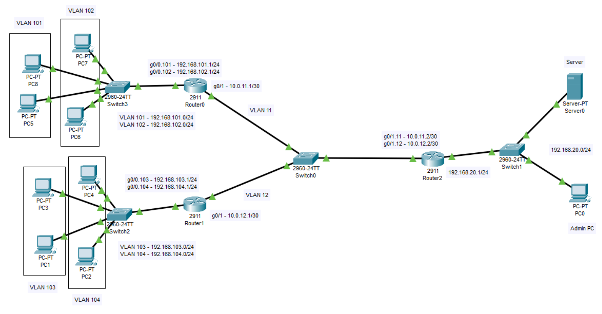
---

## Ход выполнения работы

### 1. Воспроизведение топологии и базовая адресация

Сначала была воспроизведена топология сети в среде Cisco Packet Tracer в соответствии с исходной схемой.

Были размещены следующие устройства:
- три маршрутизатора Cisco 2911 (Router0, Router1, Router2);
- четыре коммутатора Cisco 2960-24TT (Switch0, Switch1, Switch2, Switch3);
- восемь пользовательских ПК (PC1–PC8);
- сервер (Server0);
- отдельный ПК администратора (PC0, Admin PC).

Далее устройства были соединены медными прямыми кабелями (Copper Straight-Through):

- **Switch3 – Router0**: порт Fa0/1 на Switch3 к интерфейсу G0/0 Router0;  
  порты Fa0/2–Fa0/5 были подключены к PC5, PC6, PC7 и PC8.
- **Switch2 – Router1**: порт Fa0/1 на Switch2 к интерфейсу G0/0 Router1;  
  порты Fa0/2–Fa0/5 были подключены к PC1, PC2, PC3 и PC4.
- **Switch0 – Router0/Router1/Router2**:  
  Fa0/1 → G0/1 Router0, Fa0/2 → G0/1 Router1, Fa0/3 → G0/1 Router2.
- **Switch1 – Router2/Server0/PC0**:  
  Fa0/1 → G0/0 Router2, Fa0/2 → Server0, Fa0/3 → PC0 (Admin PC).

После этого на всех ПК и на сервере была выполнена статическая настройка IP‑адресации:

- VLAN 101 (Router0/Switch3): сеть 192.168.101.0/24  
  - PC8: 192.168.101.2 /24, шлюз 192.168.101.1  
  - PC5: 192.168.101.3 /24, шлюз 192.168.101.1  

- VLAN 102 (Router0/Switch3): сеть 192.168.102.0/24  
  - PC7: 192.168.102.2 /24, шлюз 192.168.102.1  
  - PC6: 192.168.102.3 /24, шлюз 192.168.102.1  

- VLAN 103 (Router1/Switch2): сеть 192.168.103.0/24  
  - PC3: 192.168.103.2 /24, шлюз 192.168.103.1  
  - PC1: 192.168.103.3 /24, шлюз 192.168.103.1  

- VLAN 104 (Router1/Switch2): сеть 192.168.104.0/24  
  - PC4: 192.168.104.2 /24, шлюз 192.168.104.1  
  - PC2: 192.168.104.3 /24, шлюз 192.168.104.1  

- Сеть сервера (Router2/Switch1): 192.168.20.0/24  
  - Server0: 192.168.20.2 /24, шлюз 192.168.20.1  
  - Admin PC (PC0): 192.168.20.10 /24, шлюз 192.168.20.1  

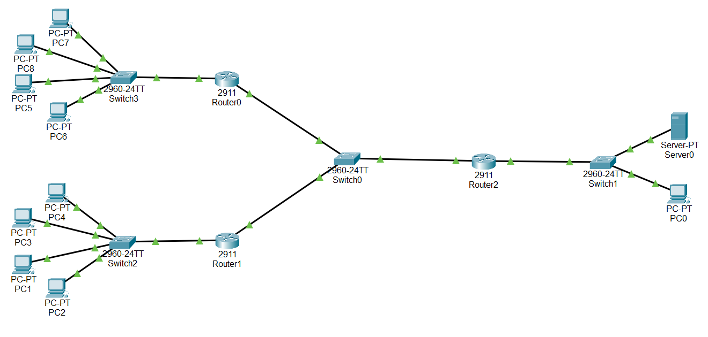

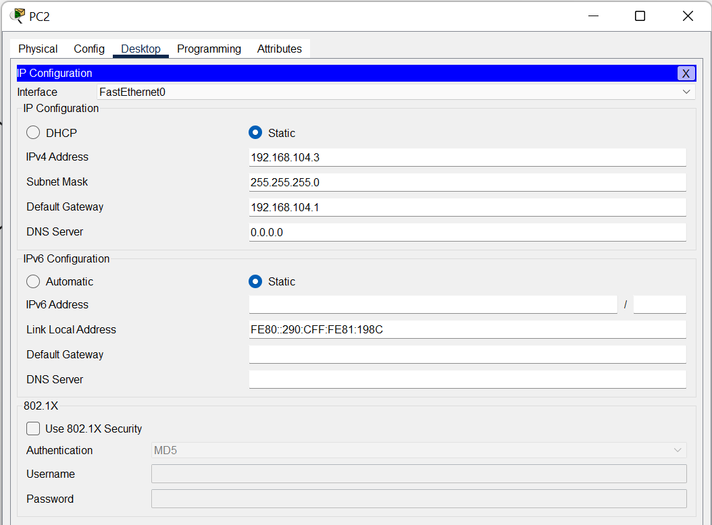

---

### 2. Настройка VLAN на коммутаторах

В рамках второго пункта задания были настроены VLAN’ы и режимы портов на всех коммутаторах.

#### 2.1 Switch3 (верхний левый, сеть Router0)

На Switch3 были созданы VLAN 101 и VLAN 102:

```text
vlan 101
 name VLAN101
vlan 102
 name VLAN102
```

Порты были распределены следующим образом:
- Fa0/2 и Fa0/3 были переведены в режим access и назначены в VLAN 101 (PC8, PC5);
- Fa0/4 и Fa0/5 были переведены в режим access и назначены в VLAN 102 (PC7, PC6);
- Fa0/1 был переведён в режим trunk, на нём были разрешены VLAN 101 и 102 для связи с Router0.

#### 2.2 Switch2 (нижний левый, сеть Router1)

На Switch2 были созданы VLAN 103 и VLAN 104:

- Fa0/2 и Fa0/3 были назначены в VLAN 103 (PC3, PC1);
- Fa0/4 и Fa0/5 были назначены в VLAN 104 (PC4, PC2);
- Fa0/1 был настроен как trunk с разрешёнными VLAN 103 и 104 для связи с Router1.

#### 2.3 Switch0 (центральный коммутатор между роутерами)

На Switch0 были созданы VLAN 11 и VLAN 12. Порты были настроены так:

- Fa0/1 был настроен как access VLAN 11 и подключён к Router0 (G0/1);
- Fa0/2 был настроен как access VLAN 12 и подключён к Router1 (G0/1);
- Fa0/3 был настроен как trunk с разрешёнными VLAN 11 и 12 и подключён к Router2 (G0/1).

#### 2.4 Switch1 (коммутатор в серверном сегменте)

На Switch1 все рабочие порты (Fa0/1–Fa0/3) были оставлены в VLAN 1 в режиме access, так как сервер и Admin PC находились в одной подсети 192.168.20.0/24.

**Пример скринов для пункта 2:**
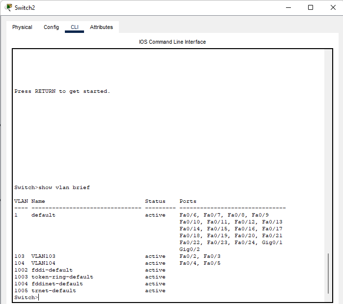
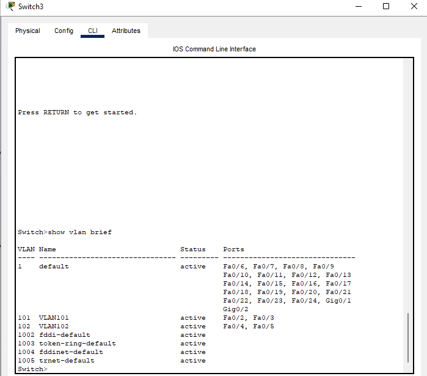
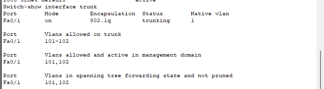
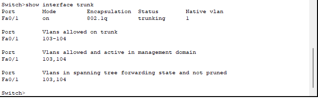

---

### 3. Настройка интерфейсов маршрутизаторов и динамической маршрутизации (RIPv2)

В этом пункте были настроены подинтерфейсы на маршрутизаторах и протокол динамической маршрутизации **RIPv2** (вариант 4).

#### 3.1 Router0

На маршрутизаторе Router0 были включены интерфейсы G0/0 и G0/1, затем были созданы подинтерфейсы:

- G0/0.101 с IP‑адресом 192.168.101.1/24 (шлюз VLAN 101, NAT inside);
- G0/0.102 с IP‑адресом 192.168.102.1/24 (шлюз VLAN 102, NAT inside);
- физический интерфейс G0/1 был настроен с адресом 10.0.11.1/30 и помечен как NAT outside для связи с Router2.

#### 3.2 Router1

На Router1 были созданы подинтерфейсы:

- G0/0.103 с IP‑адресом 192.168.103.1/24 (шлюз VLAN 103);
- G0/0.104 с IP‑адресом 192.168.104.1/24 (шлюз VLAN 104);
- интерфейс G0/1 был настроен с адресом 10.0.12.1/30 для связи с Router2.

#### 3.3 Router2

На Router2:

- интерфейс G0/0 был настроен с адресом 192.168.20.1/24 (шлюз для Server0 и Admin PC);
- интерфейс G0/1 был переведён в режим trunk, и на нём были созданы подинтерфейсы:
  - G0/1.11 с IP‑адресом 10.0.11.2/30 (связь с Router0),
  - G0/1.12 с IP‑адресом 10.0.12.2/30 (связь с Router1).

#### 3.4 Настройка RIPv2

На всех трёх маршрутизаторах был настроен протокол RIPv2 с отключением автоагрегации:

- на Router0 были объявлены сети 192.168.101.0/24, 192.168.102.0/24 и 10.0.11.0/30;
- на Router1 были объявлены сети 192.168.103.0/24, 192.168.104.0/24 и 10.0.12.0/30;
- на Router2 были объявлены сети 10.0.11.0/30, 10.0.12.0/30 и 192.168.20.0/24.

После обмена маршрутами таблицы маршрутизации на маршрутизаторах содержали записи до всех подсетей.

Для проверки были выполнены тестовые эхо‑запросы (`ping`) между различными хостами, в том числе между ПК из левых сегментов и сервером. Ответы поступали, что подтверждало корректную работу RIPv2.

**Пример скринов для пункта 3:**
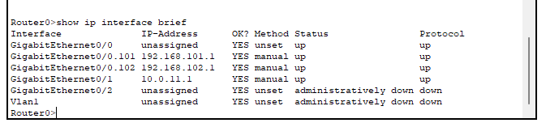
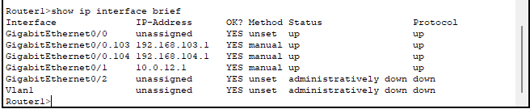
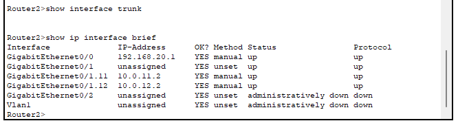
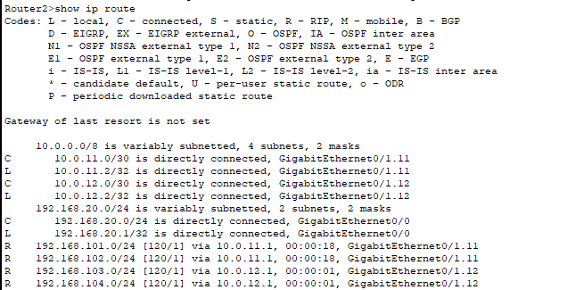


---

### 4. Настройка ACL для ограничения доступа к серверу

В соответствии с заданием требовалось, чтобы только ПК **PC1** и **PC3** из VLAN 103 имели доступ к серверу **Server0**, а все остальные узлы сети не могли обращаться к серверу.

Для этого на маршрутизаторе **Router2** был создан расширенный список доступа:

- был настроен ACL с именем `SERVER_ONLY`, в котором:
  - были разрешены IP‑соединения от адресов **192.168.103.2** (PC3) и **192.168.103.3** (PC1) к адресу сервера **192.168.20.2**;
  - было добавлено правило `deny ip any host 192.168.20.2`, запрещающее доступ всех остальных узлов к серверу;
  - в конце была оставлена разрешающая строка `permit ip any any` для остального трафика.

Полученный ACL был применён к интерфейсу G0/0 Router2 в направлении **out**. Таким образом, весь исходящий к серверу трафик проходил через этот фильтр.

Проверка показала, что:
- PC1 и PC3 успешно пинговали Server0 и могли обращаться к нему;
- остальные ПК при попытке пинга сервера получали `Request timed out`, что подтверждало срабатывание ACL.

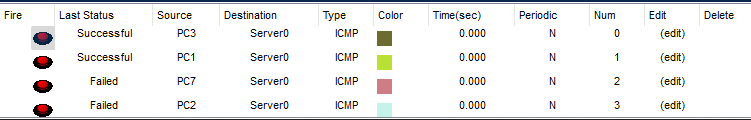

---

### 5. Настройка динамического NAT на Router0

На маршрутизаторе **Router0** была выполнена настройка динамического NAT с перегрузкой (PAT), чтобы все узлы из VLAN 101 и 102 использовали внешний адрес интерфейса G0/1 при выходе в другие сети.

Были выполнены следующие шаги:

1. Интерфейсы G0/0.101 и G0/0.102 были помечены как `ip nat inside`, а интерфейс G0/1 — как `ip nat outside`.
2. Был создан стандартный список доступа №1, в котором были разрешены сети:
   - 192.168.101.0/24,
   - 192.168.102.0/24.
3. Было настроено правило:
   ```text
   ip nat inside source list 1 interface GigabitEthernet0/1 overload
   ```
   которое заставляло все исходящие пакеты из внутренних сетей использовать адрес интерфейса G0/1 (10.0.11.1) с трансляцией портов.

После настройки NAT были выполнены эхо‑запросы с ПК из VLAN 101 и 102 к адресам в других подсетях (например, к шлюзам Router1 и Router2, а также к серверу). Пинги проходили успешно.

Команда `show ip nat translations` на Router0 показывала активные записи трансляций, что подтверждало корректную работу динамического NAT.

**Пример скринов для пункта 5:**
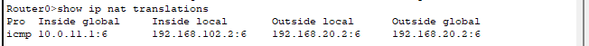

---

### 6. Настройка SSH‑доступа только с компьютера администратора

В последнем пункте задания требовалось обеспечить удалённый доступ по SSH к маршрутизаторам **Router0** и **Router1** только с компьютера администратора (адрес 192.168.20.10), запретив доступ с остальных узлов.

#### 6.1 Подготовка SSH на Router0 и Router1

На обоих маршрутизаторах были выполнены одинаковые базовые настройки:

- были заданы имена маршрутизаторов (`hostname Router0`, `hostname Router1`);
- было настроено доменное имя, например `ip domain-name lab.local`;
- был создан локальный пользователь:
  ```text
  username admin privilege 15 secret admin123
  ```
- была сгенерирована пара RSA‑ключей (`crypto key generate rsa` с длиной 1024 бит);
- была включена версия SSH 2 (`ip ssh version 2`).

#### 6.2 Ограничение доступа по VTY‑линиям

Для ограничения доступа был создан стандартный ACL №10:

```text
access-list 10 permit host 192.168.20.10
```

Далее на линиях VTY 0–4 были заданы параметры:

- `login local` — аутентификация по локальной базе пользователей;
- `transport input ssh` — разрешён только SSH;
- `access-class 10 in` — разрешён доступ только с адреса Admin PC.

Аналогичная конфигурация была выполнена и на Router0, и на Router1.

#### 6.3 Проверка работы SSH

Проверка проводилась следующим образом:

- с компьютера администратора (PC0, 192.168.20.10) из командной строки выполнялись команды:
  ```text
  ssh -l admin 10.0.11.1
  ssh -l admin 10.0.12.1
  ```
  В обоих случаях соединение по SSH успешно устанавливалось, ввод пароля `admin123` приводил к появлению приглашения CLI маршрутизатора;
- при попытке выполнить аналогичную команду `ssh` с любого другого ПК соединение не устанавливалось, что подтверждало корректную работу ACL на VTY‑линиях.

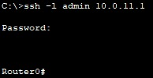
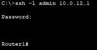
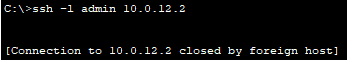
---

## Выводы

В ходе лабораторной работы была воспроизведена заданная топология сети в среде Cisco Packet Tracer и была выполнена поэтапная настройка сетевой инфраструктуры.

Были созданы VLAN на всех необходимых коммутаторах и были корректно настроены режимы access и trunk на портах. На маршрутизаторах были настроены подинтерфейсы для взаимодействия с VLAN, а также был настроен протокол динамической маршрутизации **RIPv2**, обеспечивший доступность всех подсетей.

На Router2 был настроен расширенный список контроля доступа, который обеспечил доступ к серверу только с хостов PC1 и PC3, при этом остальные устройства сети были ограничены. На Router0 была выполнена настройка динамического NAT с перегрузкой, что позволило узлам из VLAN 101 и 102 использовать внешний адрес маршрутизатора.

Кроме того, на маршрутизаторах Router0 и Router1 был настроен безопасный удалённый доступ по SSH, при этом доступ был разрешён только с компьютера администратора, что повысило безопасность управления сетью.

Поставленная цель работы была достигнута: была реализована сегментированная маршрутизируемая сеть с использованием VLAN, динамической маршрутизации, ACL, NAT и защищённого удалённого доступа.
