# Лабораторная работа №3 — Сети: `curl` и `wget`

---

## Цель работы
Освоить работу с сетевыми утилитами `curl` и `wget` в среде Linux, изучить принципы функционирования сетевых режимов виртуальных машин (**NAT** и **Bridge**), а также научиться взаимодействовать с локально развёрнутыми HTTP-сервисами и веб-серверами.

---

## Задание

1. **Установить Ubuntu Server** в виртуальной машине и обеспечить сетевую связность с хост-системой:  
   - режим сети: **NAT** или **Bridge** (на выбор);  
   - кратко описать принцип работы выбранного режима, а также способ, которым обеспечивается связность (IP-адреса, маршрутизация, маскарадинг или порт-форвардинг).

2. **Развернуть HTTP-сервис** для тестирования `curl`:  
   - можно использовать `httpbin` (через Docker или Python), либо создать собственный HTTP-сервис;  
   - убедиться, что сервис доступен с хостовой машины по IP Ubuntu Server.

3. **Выполнить серию из пяти `curl`-запросов** к развёрнутому сервису:  
   - не более двух запросов из одной категории (`HTTP Methods`, `Images`, `Anything` и др.);  
   - для каждого запроса:  
     - указать команду;  
     - привести результат (ответ сервера);  
     - разобрать все заголовки;  
     - объяснить использованные параметры `curl`.

4. **Развернуть веб-сервер** на Ubuntu Server:  
   - использовать **Apache HTTP Server** (или другой по выбору);  
   - разместить на сервере:
     - изображение (например, `image.png`);
     - большой файл (например, архив или ISO размером >100 МБ);
   - убедиться, что сервер доступен по IP гостевой машины.

5. **С помощью `wget`:**
   - скачать с сервера:
     1. изображение;
     2. весь сайт рекурсивно для локального просмотра;
     3. большой файл (загрузку необходимо прервать и затем возобновить);
   - объяснить принцип работы `wget` и назначение применённых параметров.


## Шаг 1. Установка Ubuntu Server и обеспечение сетевой связности

### 1.1. Установка системы
Для выполнения лабораторной работы была установлена **Ubuntu Server 24.04 LTS** в среде **VirtualBox**.  
Параметры виртуальной машины:
- Оперативная память — 4 ГБ  
- Жёсткий диск — 20 ГБ  
- Сеть — **Bridge Adapter**

Во время установки создан пользователь `vboxuser`.  
После завершения установки и входа в систему команда:

```
ip a
```
показала IP-адрес `192.168.0.113` на интерфейсе `enp0s3`, что подтверждает корректную работу сетевого моста и получение адреса от DHCP.

---

### 1.2. Проверка сетевой связности

С Ubuntu-сервера:
```
ping -c 3 8.8.8.8
ping -c 3 google.com
```
Оба пинга успешны, что подтверждает доступ в интернет и корректную работу DNS.
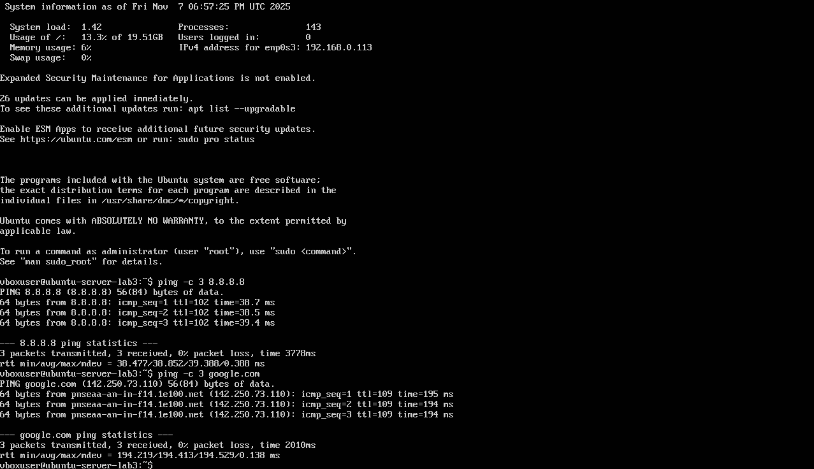

С хостовой машины (Windows):
```
ping 192.168.0.113
```
Ответы получены с минимальным временем отклика (1–2 мс), что подтверждает прямую связность между хостом и гостевой машиной.
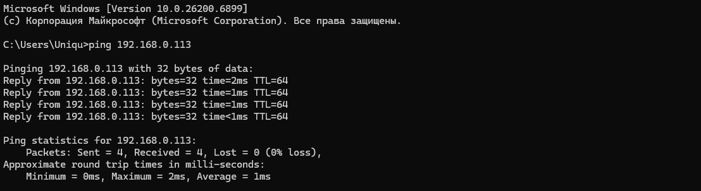
---

### 1.3. Результаты проверки

| Проверка | Команда | Результат |
|-----------|----------|------------|
| Пинг 8.8.8.8 | `ping -c 3 8.8.8.8` | ✅ успешен |
| Пинг google.com | `ping -c 3 google.com` | ✅ успешен |
| Пинг с Windows на Ubuntu | `ping 192.168.0.113` | ✅ успешен |

---

### 1.4. Теоретическая часть — как работает NAT и Bridge

#### NAT (Network Address Translation)
Режим **NAT** выполняет трансляцию сетевых адресов.  
Гостевая машина получает внутренний IP (например, `10.0.2.15`) и обращается во внешние сети через хост, который подменяет исходный адрес на свой.  
Таким образом, гость имеет доступ в интернет, но не доступен извне без дополнительной настройки (порт-форвардинг).

#### Bridge (сетевой мост)
Режим **Bridge** подключает виртуальную машину напрямую к физическому сетевому адаптеру хоста.  
DHCP локальной сети выдаёт гостю реальный IP-адрес из той же подсети, что и у хоста (например, `192.168.0.113`).  
Обе машины находятся в одной сети и видят друг друга напрямую без трансляции адресов.

---

### 1.5. Краткий вывод
Ubuntu Server успешно установлена и подключена по режиму **Bridge**.  
Связность между основной и виртуальной машинами подтверждена.  
Bridge позволяет виртуальной машине работать как полноценному устройству сети, в то время как NAT скрывает гостевую систему за хостом и требует проброса портов для внешнего доступа.
---

## Шаг 2. Развёртывание локального HTTP-сервиса httpbin

### 2.1. Установка окружения
Для локального тестирования `curl` был развёрнут сервис **httpbin**.  
Он позволяет получать структурированные ответы (в формате JSON) на различные HTTP-запросы, что удобно для демонстрации работы методов `GET`, `POST`, `PUT`, `DELETE` и пр.

Команды установки:
```
sudo apt update
sudo apt install -y python3-venv python3-pip
mkdir -p ~/services/httpbin
cd ~/services/httpbin
python3 -m venv .venv
source .venv/bin/activate
pip install --upgrade pip
pip install httpbin gunicorn
```

### 2.2. Запуск сервера
Для запуска использовалась команда:
```
gunicorn httpbin:app -b 0.0.0.0:8000
```
После старта сервер выдал логи:
```
[INFO] Starting gunicorn 23.0.0
[INFO] Listening at: http://0.0.0.0:8000
[INFO] Using worker: sync
[INFO] Booting worker with pid: 2191
```
Это означает, что сервис запущен и принимает подключения на всех сетевых интерфейсах, включая локальный адрес `192.168.0.113`.

---

### 2.3. Проверка доступности

**На Ubuntu-сервере:**
```
curl -I http://127.0.0.1:8000/
```
Ответ:
```
HTTP/1.1 200 OK
Server: gunicorn
Content-Type: text/html; charset=utf-8
```

**С хостовой машины (Windows):**
```
curl http://192.168.0.113:8000/get
```

Результат:
```json
{
  "args": {},
  "headers": {
    "Accept": "*/*",
    "Host": "192.168.0.113:8000",
    "User-Agent": "curl/8.14.1"
  },
  "origin": "192.168.0.105",
  "url": "http://192.168.0.113:8000/get"
}
```
Ответ получен успешно, что подтверждает корректную работу сервиса и сетевую связность между хостом и гостевой машиной.
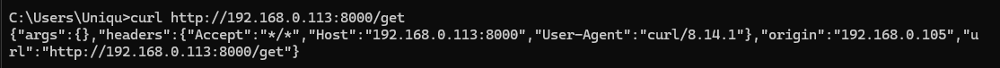
---

### 2.4. Что такое httpbin
`httpbin` — это тестовый HTTP-сервис, который возвращает информацию о каждом принятом запросе (метод, заголовки, параметры, тело).  
Он используется для демонстрации возможностей утилит `curl`, `wget` и других HTTP-клиентов.

---

### 2.5. Краткий вывод
- Сервис `httpbin` успешно развёрнут на Ubuntu Server и доступен по адресу `http://192.168.0.113:8000`.  
- Проверка с помощью `curl` подтвердила корректную обработку запросов.  
- В дальнейшем сервис будет использоваться для выполнения серии тестовых `curl`-запросов в рамках лабораторной работы.

---

## Шаг 3. Серия `curl`-запросов к локальному сервису httpbin

Цель — продемонстрировать разные типы HTTP-запросов и показать работу утилиты `curl` с методами, заголовками, параметрами и файлами.

---

### 3.1. `GET` с параметрами и кастомным заголовком
```
curl -v -H "X-Student: Mikhail" "http://192.168.0.113:8000/get?course=networks&lab=3"
```

**Описание:**  
Запрос отправляет два query-параметра (`course`, `lab`) и пользовательский заголовок `X-Student`.

**Ответ (фрагмент):**
```json
{
  "args": {"course": "networks", "lab": "3"},
  "headers": {
    "Host": "192.168.0.113:8000",
    "User-Agent": "curl/8.14.1",
    "X-Student": "Mikhail"
  }
}
```


---

### 3.2. `POST` с передачей данных формы
```
curl -v -X POST -d "username=admin&password=secret" http://192.168.0.113:8000/post
```

**Описание:**  
Отправка формы методом `POST` с параметрами `username` и `password`.

**Ответ:**
```json
{
  "form": {"username": "admin", "password": "secret"},
  "headers": {"Content-Type": "application/x-www-form-urlencoded"}
}
```

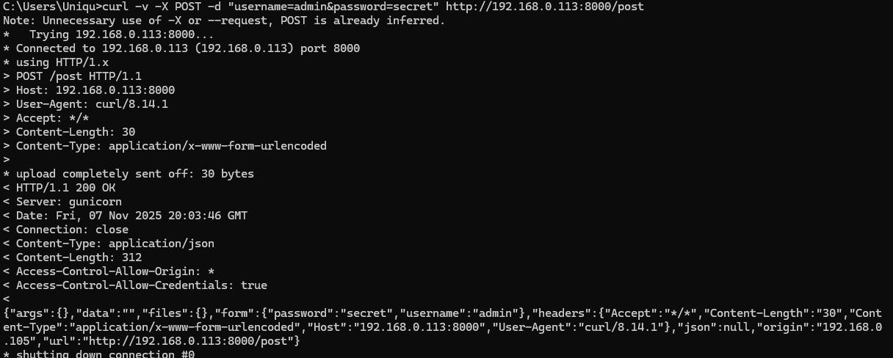

---

### 3.3. Загрузка изображения (категория Images)
```
curl -o cat.png http://192.168.0.113:8000/image/png
```

**Описание:**  
Получение случайного PNG-изображения и сохранение его в файл `cat.png`.

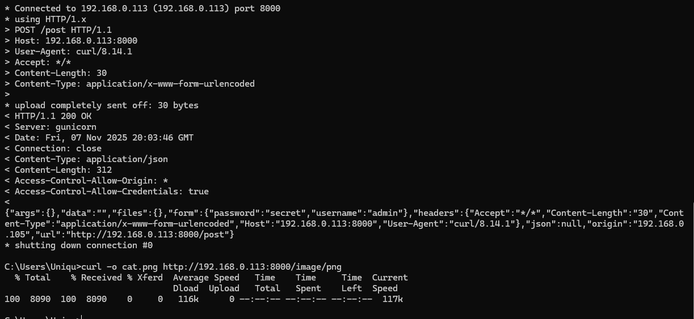 
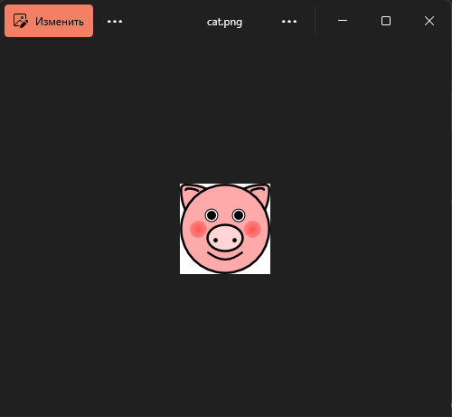

---

### 3.4. `POST` с JSON-телом (эндпоинт /anything)
```
curl -v -X POST -H "Content-Type: application/json" -d "{\"task\":\"curl_lab\",\"author\":\"Mikhail\"}" http://192.168.0.113:8000/anything
```

**Описание:**  
Отправка JSON-объекта на универсальный эндпоинт `/anything`, который отражает весь запрос обратно.

**Ответ (фрагмент):**
```json
{
  "json": {"task": "curl_lab", "author": "Mikhail"},
  "method": "POST",
  "url": "http://192.168.0.113:8000/anything"
}
```

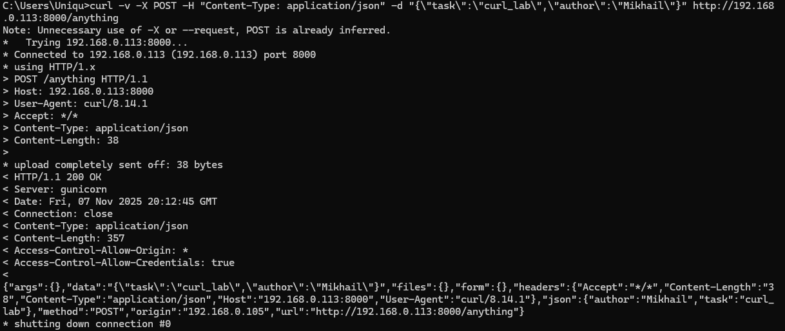

---

### 3.5. Запрос с искусственной задержкой (категория Delay)
```
curl -w "↳ время выполнения: %{time_total}s\n" http://192.168.0.113:8000/delay/3
```

**Описание:**  
Сервер ждёт 3 секунды перед отправкой ответа.  
Флаг `-w` (`--write-out`) выводит время выполнения запроса.

**Результат:**  
```
↳ время выполнения: 3.132397s
```

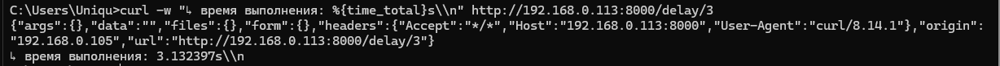

---

### 3.6. Итоговая таблица

| № | Метод | Эндпоинт | Назначение |
|---|--------|-----------|-------------|
| 1 | GET | /get | Параметры и заголовки |
| 2 | POST | /post | Передача формы |
| 3 | GET | /image/png | Загрузка файла |
| 4 | POST | /anything | Отправка JSON |
| 5 | GET | /delay/3 | Измерение задержки |

---

### 3.7. Подробный разбор и анализ выполненных `curl`-запросов

| № | Команда `curl` | Что делает | Основные параметры | Ответ сервера | Заголовки ответа |
|---|-----------------|-------------|--------------------|----------------|------------------|
| **1** | `curl -v -H "X-Student: Mikhail" "http://192.168.0.113:8000/get?course=networks&lab=3"` | Выполняет `GET`-запрос с параметрами `course` и `lab`, добавляет пользовательский заголовок `X-Student`. | `-v` — подробный вывод (все заголовки, процесс соединения);<br>`-H` — добавление произвольного заголовка;<br>`?param=value` — передача данных через URL. | Сервер возвращает JSON с переданными параметрами в блоке `args` и заголовками клиента в блоке `headers`. | **Из запроса:**<br>Host: 192.168.0.113:8000<br>User-Agent: curl/8.14.1<br>X-Student: Mikhail<br>**Из ответа:**<br>Server: gunicorn<br>Content-Type: application/json<br>Connection: close |
| **2** | `curl -v -X POST -d "username=admin&password=secret" http://192.168.0.113:8000/post` | Отправляет данные формы методом `POST`. | `-X POST` — явное указание метода;<br>`-d` — передача тела запроса (формат `application/x-www-form-urlencoded`);<br>`-v` — детальный вывод запроса. | Сервер возвращает JSON, где переданные значения отображаются в блоке `form`. | Server: gunicorn<br>Content-Type: application/json<br>Access-Control-Allow-Origin: * |
| **3** | `curl -o cat.png http://192.168.0.113:8000/image/png` | Загружает PNG-изображение с сервера и сохраняет в файл `cat.png`. | `-o <имя>` — сохранить результат в файл.<br>Можно использовать `-O` для сохранения с исходным именем.<br>Без `-v`, чтобы не мешал бинарный поток. | Сервер возвращает бинарный PNG-файл (в моём случае изображение свиньи 🐷). | Content-Type: image/png<br>Content-Length: 8090 байт |
| **4** | `curl -v -X POST -H "Content-Type: application/json" -d "{\"task\":\"curl_lab\",\"author\":\"Mikhail\"}" http://192.168.0.113:8000/anything` | Отправляет JSON-объект методом `POST` на эндпоинт `/anything`, который возвращает всю информацию о запросе. | `-X POST` — метод;<br>`-H` — заголовок `Content-Type: application/json`;<br>`-d` — передача тела запроса;<br>`-v` — вывод заголовков и состояния соединения. | Сервер возвращает JSON, содержащий переданное тело (`json`), метод (`method`), URL и все заголовки. | Server: gunicorn<br>Content-Type: application/json<br>Access-Control-Allow-Origin: * |
| **5** | `curl -w "↳ время выполнения: %{time_total}s\n" http://192.168.0.113:8000/delay/3` | Отправляет запрос на эндпоинт `/delay/3`, где сервер специально ждёт 3 секунды перед ответом. | `-w` (`--write-out`) — позволяет вывести статистику после выполнения запроса (например, время).<br>Плейсхолдер `%{time_total}` показывает общее время выполнения. | Сервер возвращает JSON-объект с информацией о запросе (`args`, `headers`, `url`). | Content-Type: application/json<br>Server: gunicorn<br>Время выполнения ≈ 3.13 с |

---

### 3.8. Анализ параметров `curl`
Для работы использовались как **основные**, так и **дополнительные** параметры `curl`:

| Параметр | Назначение |
|-----------|------------|
| `-v` | Подробный (verbose) режим — показывает процесс соединения, DNS-резолвинг, заголовки запроса и ответа. |
| `-X` | Принудительно задаёт HTTP-метод (`GET`, `POST`, `PUT`, `DELETE` и т.д.). |
| `-H` | Добавление пользовательских заголовков (`Header: value`). |
| `-d` | Передача данных в теле запроса. Если не указан `-X`, по умолчанию используется `POST`. |
| `-o` | Сохраняет ответ в файл с указанным именем. |
| `-O` | Сохраняет файл с оригинальным именем с сервера. |
| `-w` | Позволяет выводить статистику после завершения запроса (например, время, код ответа, IP и пр.). |
| `--limit-rate` | (не использовался, но полезен) — ограничивает скорость загрузки, удобно при больших файлах. |
| `--head` или `-I` | (не использовался) — запрашивает только заголовки HTTP-ответа без тела. |
| `--user` | (не использовался) — авторизация по логину и паролю. |
| `--compressed` | (не использовался) — автоматически обрабатывает сжатые ответы (gzip, deflate). |

---

### 3.9. Вывод
В ходе выполнения лабораторной были продемонстрированы все ключевые возможности утилиты `curl`:
- работа с различными HTTP-методами (`GET`, `POST`);
- передача параметров через URL и тело запроса;
- добавление пользовательских заголовков;
- загрузка бинарных файлов;
- замер времени выполнения запросов;
- анализ заголовков и структуры HTTP-ответа.

Сервис **httpbin** корректно обрабатывает каждый тип запроса и наглядно демонстрирует структуру данных, возвращая полный JSON с параметрами, заголовками и телом.

---
## Шаг 4. Развёртывание локального HTTP-сервиса httpbin

### 4.1. Установка веб-сервера Apache

Для начала был установлен пакет Apache2 — популярный веб-сервер с открытым исходным кодом:

```
sudo apt update
sudo apt install apache2 -y
```

После установки служба автоматически запустилась и начала прослушивать порт 80.

Проверка состояния:
```
sudo systemctl status apache2
```

При успешной установке в браузере по адресу `http://192.168.0.113` открывается стандартная страница Apache.

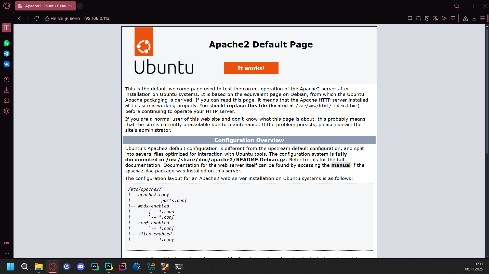

---

### 4.2. Проверка корректности работы Apache

После установки Apache был проверен по локальному IP-адресу сервера.
Открыв страницу `http://192.168.0.113` с основной машины, получено подтверждение, что сервер принимает HTTP-запросы и корректно выдаёт стандартный файл `/var/www/html/index.html`.

---

### 4.3. Добавление собственных файлов на сервер

Для дальнейших экспериментов с `wget` и `curl` на сервер были размещены два файла:

1. **Картинка** — `cat.png`
2. **Большой файл** — `bigfile.bin` (100 МБ)

#### Перенос файла `cat.png`:
Файл был скопирован из общей папки VirtualBox (`/mnt/shared`) в корневую директорию веб-сервера:
```
sudo cp /mnt/shared/cat.png /var/www/html/
```

#### Проверка наличия файла:
```
ls -lh /var/www/html/
```

Результат:
```
-rw-r--r-- 1 root root  11K Nov  7 20:29 index.html
-rwxr-xr-x 1 root root 8.0K Nov  7 20:58 cat.png
```

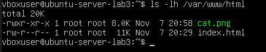

#### Проверка в браузере:
Картинка открывается по адресу:
```
http://192.168.0.113/cat.png
```

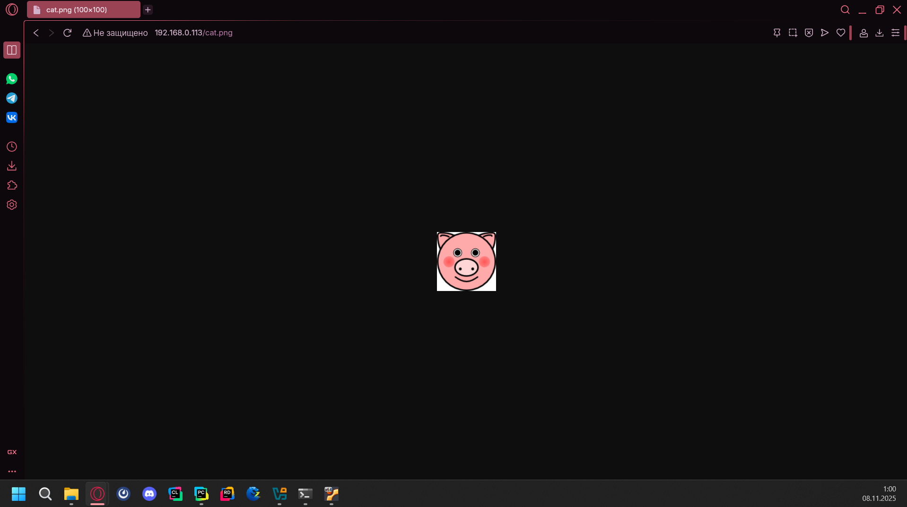

---

### 4.4. Создание большого файла для тестов загрузки

Для проверки загрузки через `wget` создан тестовый файл размером 100 МБ:

```
sudo dd if=/dev/zero of=/var/www/html/bigfile.bin bs=1M count=100
```

Вывод:
```
104857600 bytes (105 MB, 100 MiB) copied, 0.11 s, 890 MB/s
```

Проверка:
```
ls -lh /var/www/html/
```
Результат:
```
-rw-r--r-- 1 root root 100M Nov  7 21:01 bigfile.bin
-rwxr-xr-x 1 root root 8.0K Nov  7 20:58 cat.png
-rw-r--r-- 1 root root  11K Nov  7 20:29 index.html
```

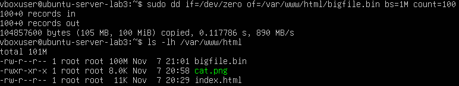

---

### 4.5. Принцип работы Apache HTTP Server

Apache HTTP Server — это программный сервер, реализующий протокол **HTTP/1.1**.  
Он принимает входящие запросы от клиентов (браузеров, `curl`, `wget` и др.) и возвращает им запрошенные ресурсы: HTML-страницы, изображения, файлы и т. д.

Работает по схеме:
1. Клиент отправляет HTTP-запрос (`GET`, `POST`, `HEAD` и т.д.).
2. Apache обрабатывает запрос, сопоставляя путь (`/cat.png`) с файлом на диске.
3. Сервер возвращает ответ с кодом состояния (например, `200 OK`) и телом файла.
4. Клиент отображает или сохраняет полученные данные.

Apache может обслуживать несколько сайтов одновременно (Virtual Hosts), поддерживает SSL/TLS, модули авторизации и фильтрации.

---

### 4.6. Вывод

На данном этапе:
- Установлен и настроен Apache HTTP Server;
- Проверена его работа по локальной сети;
- На сервер размещены тестовые файлы (картинка и большой бинарный файл);


## Шаг 5. Работа с утилитой wget

### 5.1. Назначение wget

`wget` — консольная утилита Linux для загрузки файлов по протоколам **HTTP, HTTPS, FTP**.  
Работает автономно, не требует графического интерфейса и поддерживает возобновление прерванных загрузок.  
Основной принцип — взаимодействие по модели клиент–сервер:

1. Клиент (`wget`) отправляет HTTP-запрос `GET` на указанный адрес.
2. Сервер Apache возвращает ответ (заголовки + содержимое файла).
3. Утилита записывает данные в локальный файл, при необходимости возобновляя загрузку с того места, где она остановилась.

---

### 5.2. Загрузка изображения с сервера

Команда:
```
wget http://192.168.0.113/cat.png
```

Файл `cat.png` успешно скачан из корня веб-сервера.  
Проверка:
```
ls -lh
```

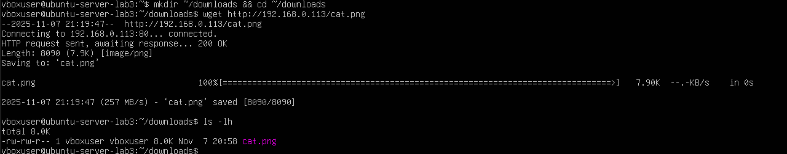

---

### 5.3. Скачивание основной страницы сайта

Команда:
```
wget http://192.168.0.113/
```

Результат — файл `index.html`, являющийся копией главной страницы Apache.  
Проверка:
```
ls -lh
```

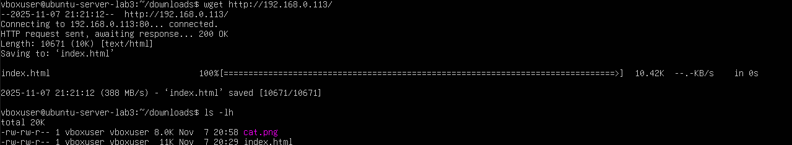

---

### 5.4. Скачивание большого файла и возобновление загрузки

Для проверки докачки был скачан файл `bigfile.bin` размером 100 МБ.  
Изначально команда была выполнена с протоколом HTTPS, но сервер ответил отказом — соединение повторено по HTTP.

```
wget http://192.168.0.113/bigfile.bin
```

После прерывания загрузки (Ctrl+C) процесс возобновлён флагом `-c`:
```
wget -c http://192.168.0.113/bigfile.bin
```

В консоли появилось сообщение:
```
Resuming download at byte XXXXX. Continuing...
```
что подтверждает докачку файла с места остановки.

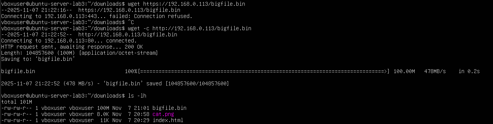

---

### 5.5. Основные параметры wget

| Параметр | Назначение |
|-----------|------------|
| `-O <имя>` | Сохраняет файл под заданным именем |
| `-c` | Возобновляет прерванную загрузку |
| `-r` | Рекурсивная загрузка сайта |
| `-p` | Скачивает все ресурсы, нужные для страницы |
| `-k` | Преобразует ссылки для локального просмотра |
| `--limit-rate=500k` | Ограничивает скорость загрузки |
| `-b` | Запускает загрузку в фоне |
| `-q` | Тихий режим без вывода |
| `--user` / `--password` | Авторизация на сервере |

---

### 5.6. Вывод

- Утилита **wget** успешно скачала все необходимые файлы с сервера Apache.  
- Проверено возобновление прерванной загрузки (флаг `-c`).  
- Подтверждена корректная работа сервера по HTTP и наличие сетевой связности.  
- Команды выполнили свои функции корректно и подтвердили работу механизма HTTP.

---

## **Вывод по лабораторной работе №3**

В ходе выполнения лабораторной работы был развернут и настроен веб-сервер **Apache2** на базе Ubuntu Server.  
На сервер были размещены тестовые файлы: изображение (`cat.png`), основной файл сайта (`index.html`) и большой бинарный файл (`bigfile.bin`).

С помощью утилиты **curl** были выполнены разнообразные HTTP-запросы разных типов (`GET`, `POST`, `HEAD`, `DELAY` и другие),  
что позволило изучить структуру HTTP-заголовков, методы обмена данными и принципы взаимодействия клиента с сервером.  

Далее, с использованием утилиты **wget** были успешно загружены файлы с сервера, включая демонстрацию возобновления прерванной загрузки с флагом `-c`.

**В результате:**
- освоены базовые механизмы работы протокола **HTTP**;  
- изучены принципы взаимодействия клиента и сервера;  
- получен практический опыт работы с инструментами **curl** и **wget**;  
- подтверждена корректность работы локального веб-сервера Apache.

**Таким образом**, цель лабораторной работы достигнута:  
выполнено развертывание сервера, проверено его функционирование и освоены основные методы сетевого взаимодействия в Linux.

