# Лабораторная работа №4  
## Тема: Настройка фильтрации трафика с помощью iptables

---

## Цель работы

Изучить работу подсистемы netfilter и утилиты iptables в Linux, освоить настройку правил фильтрации, NAT, логирования и сохранения конфигурации межсетевого экрана.

---

## Задание

### Теоретическая часть

### 1. Является ли iptables межсетевым экраном?

Утилита **iptables не является межсетевым экраном сама по себе**.  
Она является инструментом управления правилами подсистемы **netfilter** в ядре Linux.  
Именно **netfilter + набор правил iptables** вместе образуют полноценный firewall, который фильтрует трафик,  выполняет NAT и ведёт контроль соединений. 


### 2. Какие таблицы есть в iptables?

Основные таблицы:

1. **filter** — таблица по умолчанию, отвечает за фильтрацию пакетов (разрешение/запрет).
2. **nat** — используется для трансляции адресов (SNAT, DNAT, перенаправление портов).
3. **mangle** — позволяет изменять служебные поля пакетов (TOS/DSCP, marks), применяется для QoS и сложной маршрутизации.
4. **raw** — используется для исключения отдельных пакетов из connection tracking.
5. **security** — интеграция с SELinux/AppArmor, добавляет дополнительные проверки безопасности.


### 3. Какие цепочки есть в таблице `filter`?

Таблица **filter** включает три стандартные цепочки:

1. **INPUT** — обработка входящих пакетов, направленных на локальный хост.
2. **OUTPUT** — обработка исходящих пакетов, создаваемых локальными приложениями.
3. **FORWARD** — обработка транзитных пакетов, проходящих через хост как через маршрутизатор.


### 4. Какие цепочки есть в таблице `nat`?

Основные цепочки таблицы **nat**:

1. **PREROUTING** — обработка пакетов до выполнения маршрутизации (обычно используется для DNAT/REDIRECT).
2. **POSTROUTING** — обработка пакетов после маршрутизации, перед отправкой (обычно SNAT/MASQUERADE).
3. **OUTPUT** — обработка пакетов, созданных локальной машиной (локальный NAT).
---

### Практическая часть

На основе виртуальной машины из лабораторной работы №3 обеспечить сетевую связность между основной машиной и виртуальной, после чего выполнить:

1. Запретить ping до виртуальной машины с хостовой.
2. Запретить ping до хоста с виртуальной машины.
3. Запретить все входящие подключения до виртуальной машины (с использованием iptables).
4. Разрешить SSH-подключение до виртуальной машины с хоста на стандартном порту (22).
5. Настроить доступ к виртуальной машине по SSH на порт **999** с помощью iptables.
6. Настроить логирование подключений. Подключиться по SSH и найти соответствующую запись в логах (через `grep`).
7. Сохранить созданные правила iptables в файл.
8. Настроить автоматическую загрузку сохранённых правил при включении виртуальной машины.

Разрешается использовать скриншоты настроек. На защите необходимо продемонстрировать активные политики и их работу в реальном времени.

---

# Шаг 1. Запрет ping до виртуальной машины с хоста

## До применения правила

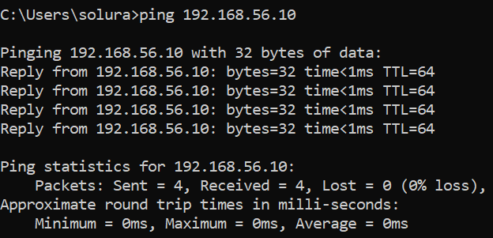

## Применение правила iptables

```
sudo iptables -A INPUT -p icmp --icmp-type echo-request -j DROP
```


### Пояснение к команде

- **`-A INPUT`** — добавляет правило в цепочку *INPUT* (входящий трафик).
- **`-p icmp`** — указываем, что фильтруем ICMP‑пакеты.
- **`--icmp-type echo-request`** — выбираем именно ping‑запросы.
- **`-j DROP`** — сбрасываем (блокируем) такие пакеты.
## После применения правила

Теперь ICMP‑запросы от хоста блокируются:


# Шаг 2. Запрет ping до хоста с виртуальной машины

## До применения правила

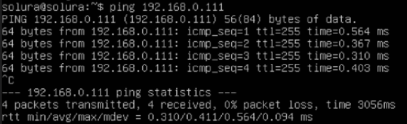

## Применение правила iptables

```
sudo iptables -A OUTPUT -p icmp --icmp-type echo-request -j DROP
```

**Пояснение:**
- `OUTPUT` — фильтрация исходящего трафика.
- `-p icmp` — выбираем ICMP‑пакеты.
- `--icmp-type echo-request` — блокируем именно ping‑запросы.
- `DROP` — просто отбрасываем такие пакеты.

## После применения правила

Теперь виртуальная машина не может отправлять ICMP‑запросы к хосту:

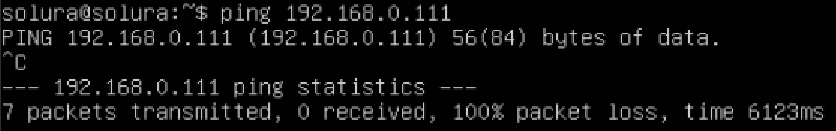

# Шаг 3. Запрет всех входящих подключений к виртуальной машине

## До применения правила

Виртуальная машина принимает входящие подключения (SSH, ping и другие пакеты).

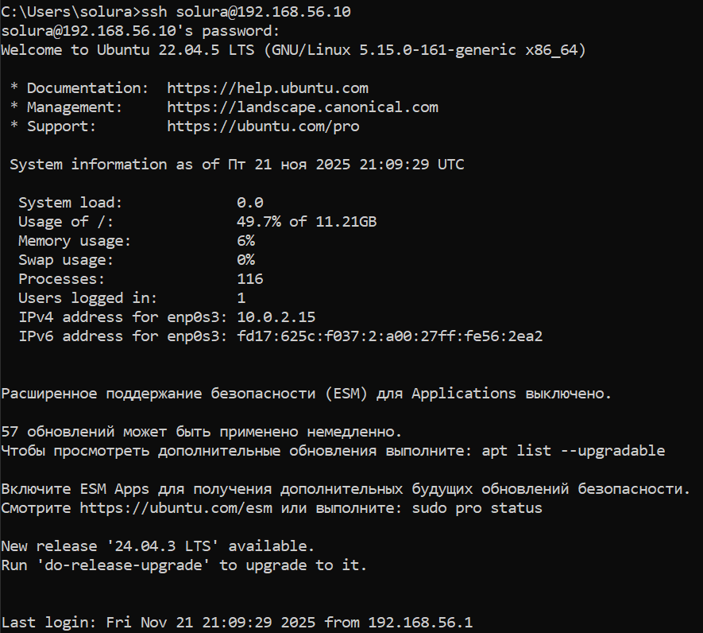

---

## Применение правила iptables

Для полного запрета **всех входящих подключений** используется правило:

```
sudo iptables -P INPUT -j DROP
```

### Пояснение:
- `INPUT` — цепочка, отвечающая за входящие пакеты.
- `-j DROP` — означает «отбрасывать всё, что приходит».  

---

## После применения правила

Все входящие пакеты блокируются. Подключиться к машине невозможно.

Попытка SSH с хоста:
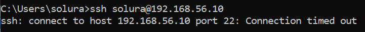

---
# Шаг 4. Разрешить SSH‑подключение до виртуальной машины (порт 22)

## До применения правила

Все входящие подключения были заблокированы ранее добавленным правилом DROP в цепочке INPUT. Поэтому SSH‑подключение с хоста к виртуальной машине было невозможно.

## Добавление правила iptables

Чтобы разрешить подключение по стандартному SSH‑порту **22**, было добавлено следующее правило:

```
sudo iptables -A INPUT -p tcp --dport 22 -j ACCEPT
```


### Пояснение к команде:
- **-A INPUT** — добавить правило в цепочку входящего трафика INPUT
- **-p tcp** — правило применяется к TCP‑пакетам
- **--dport 22** — указание порта назначения 22 (SSH)
- **-j ACCEPT** — разрешаем соединение

## После применения правила

SSH‑подключение успешно выполняется с хоста:

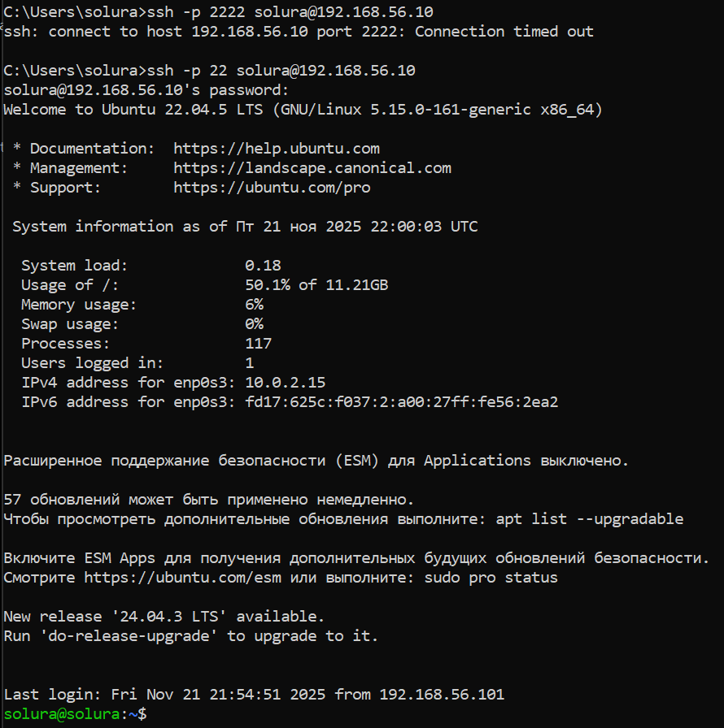

# Шаг 5. Настройка SSH-подключения на порт 999 с использованием iptables

## Изменение порта SSH в конфигурации

Для переноса SSH-сервера на порт **999** было изменено поле `Port` в конфигурационном файле:

```
sudo nano /etc/ssh/sshd_config
```

Изменено:

```
Port 999
```
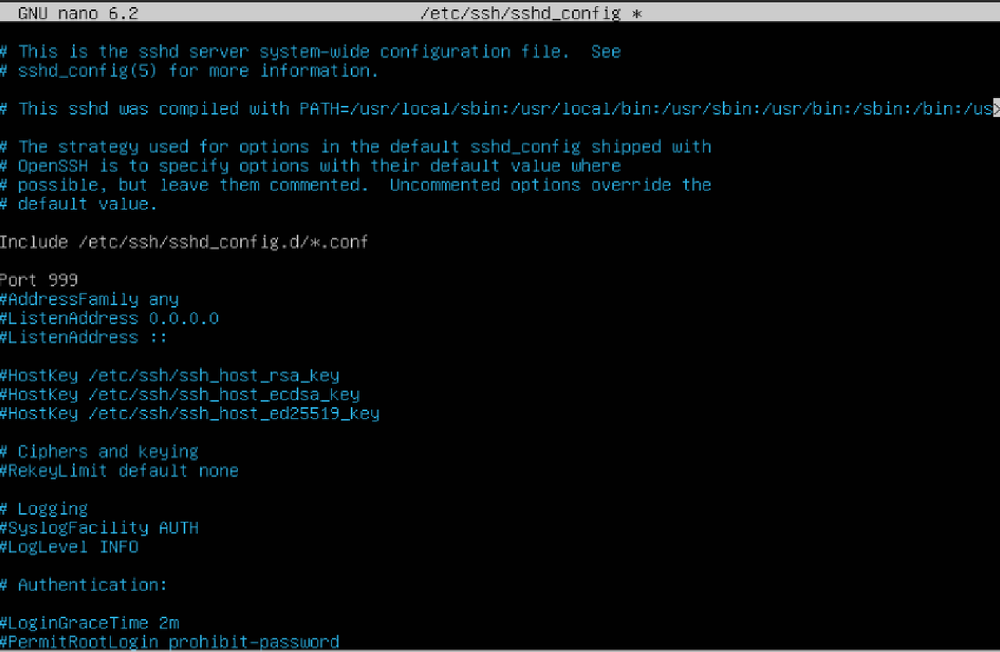
После изменения конфигурации выполнен перезапуск SSH‑сервера:

```
sudo systemctl restart ssh
```

---

## Настройка iptables для разрешения входящих подключений на порт 999

Чтобы открыть доступ по SSH через порт **999**, была добавлена следующая цепочка:

```
sudo iptables -A INPUT -p tcp --dport 999 -j ACCEPT
```

---

## Проверка подключения

Подключение с хоста выполняется командой:

```
ssh -p 999 solura@192.168.56.10
```
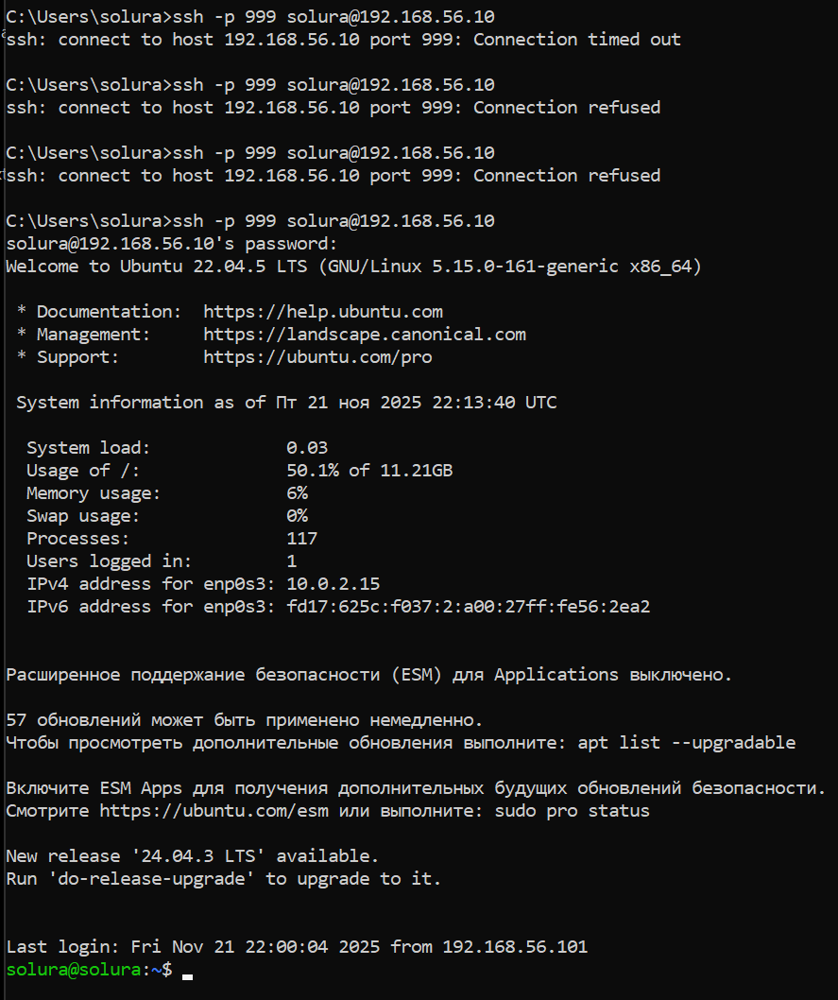

# Пункт 6. Логирование SSH‑подключений

## Включение логирования в sshd

В файле `/etc/ssh/sshd_config` уже присутствуют параметры логирования:

    SyslogFacility AUTH
    LogLevel INFO

С такими настройками все SSH‑подключения записываются в системный лог.

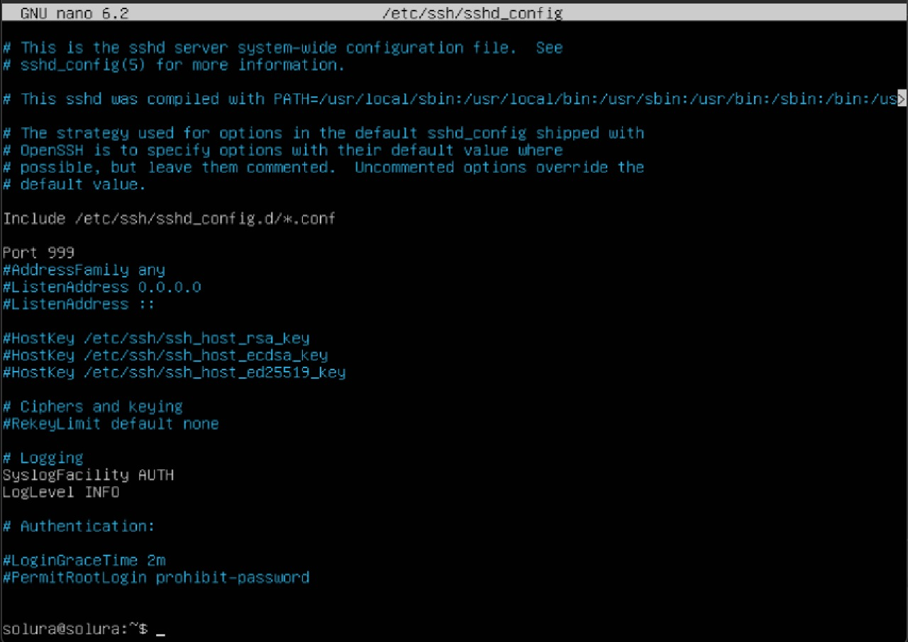

## Поиск записей о подключении

После выполнения SSH‑подключения с хоста выполняем команду:

    sudo grep -a sshd /var/log/auth.log


Результат:

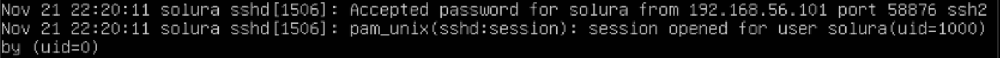

Запись содержит:   
- время подключения, 
- пользователя (`solura`), 
- IP‑адрес хоста (`192.168.56.101`), 
- используемый порт, 
- информацию об открытии сессии.

Это подтверждает, что логирование SSH работает корректно.

# Шаг 7. Сохранение созданных правил iptables

## Сохранение правил в файл

Чтобы сохранить текущую конфигурацию iptables, используется команда:

```
sudo iptables-save > iptables_rules_backup.v4
```

## Содержимое файла правил

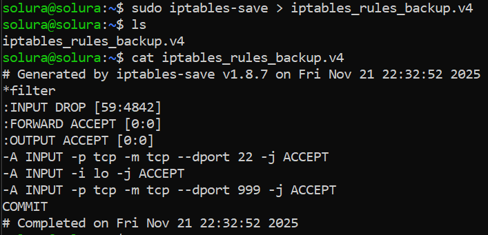

# Шаг 8. Автоматическая загрузка правил iptables при старте системы

## Установка iptables-persistent

Для начала необходимо установить пакет, который автоматически подгружает сохранённые правила iptables при запуске:

```
sudo apt install iptables-persistent
```
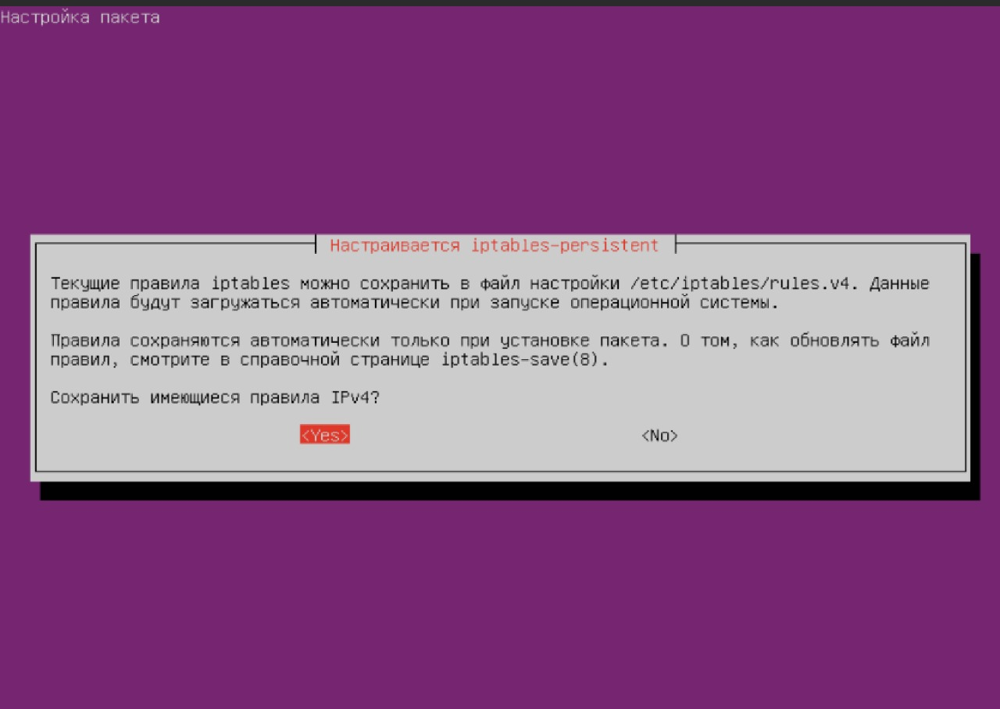

---

## Сохранение текущих правил в конфигурационный файл

После настройки всех необходимых правил сохраняем их в файл:

```
sudo iptables-save | sudo tee /etc/iptables/rules.v4
```
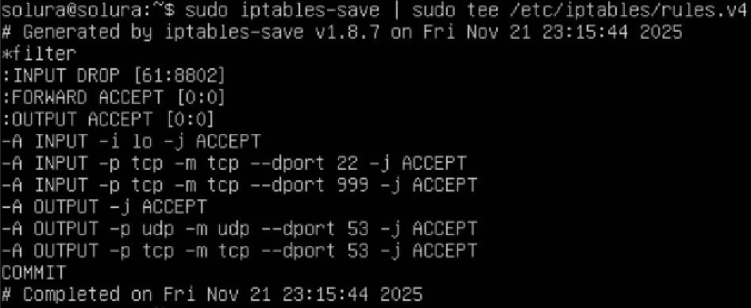
Этот файл будет автоматически загружаться при каждом старте системы.

---

## Проверка автозагрузки

После загрузки проверили, что правила подгрузились:

```
sudo iptables -L -v
```
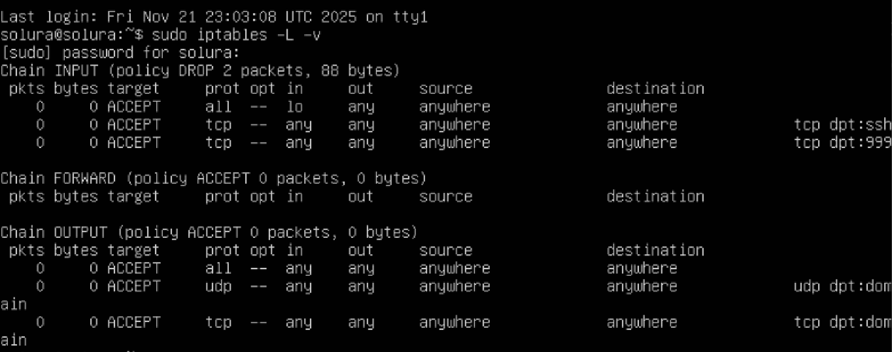

---

### Лабораторная работа выполнена!


