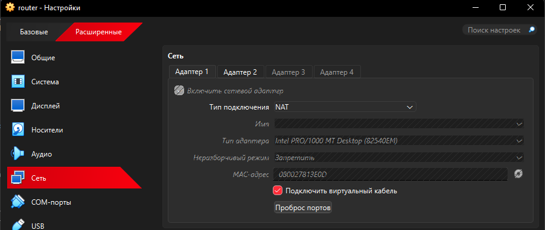
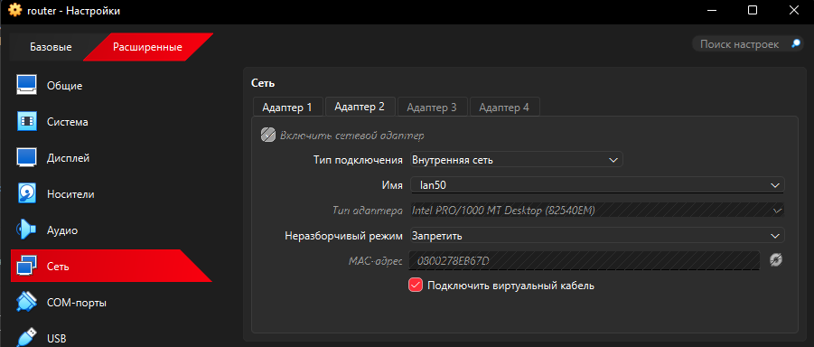
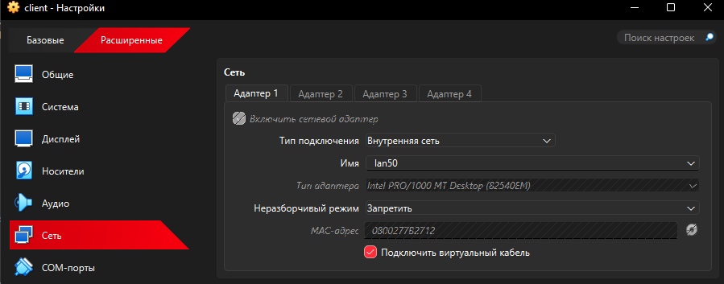
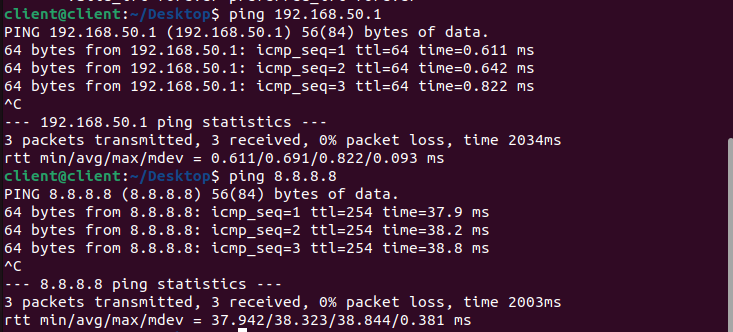
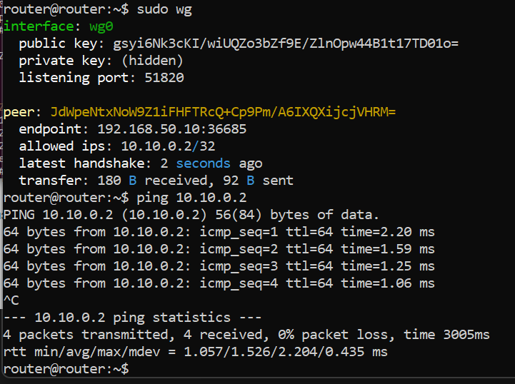
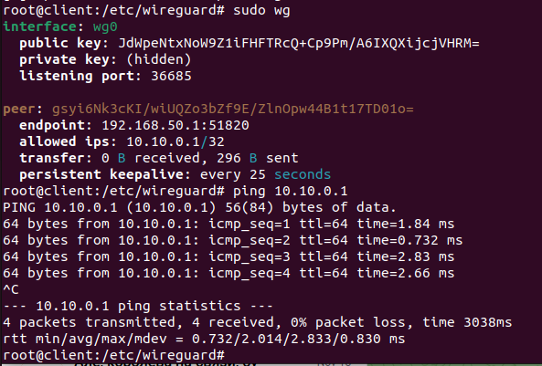

# Лабораторная работа №5  
**Тема:** Настройка маршрутизатора и VPN в виртуальной сети

---

## Цель работы

1. Настроить виртуальную сеть из двух машин на базе Linux, где одна из них выполняет роль маршрутизатора с выходом в Интернет.
2. Реализовать раздачу адресов по DHCP для хостов локальной сети.
3. Обеспечить доступ клиентской машины к ресурсам Интернет через настроенный маршрутизатор.
4. Настроить VPN-соединение между виртуальными машинами с использованием протокола WireGuard.
5. Закрепить навыки настройки сетевых интерфейсов, маршрутизации, NAT, DHCP и VPN в Linux.

---

## Задание

1. **Основная часть:**
   - Настроить две виртуальные машины (любой дистрибутив Linux).
   - Первая виртуальная машина (VM1) – **маршрутизатор**:
     - Имеет два сетевых интерфейса:
       - `enp0s3` – тип подключения **NAT** (доступ в Интернет).
       - `enp0s8` – тип подключения **Внутренняя сеть** (LAN).
   - Вторая виртуальная машина (VM2) – **клиент**:
     - Один сетевой интерфейс:
       - `enp0s3` – тип подключения **Внутренняя сеть** (LAN).
   - Настроить VM1 как маршрутизатор:
     - Включить IP-маршрутизацию.
     - Настроить NAT для выхода клиентов в Интернет.
   - Настроить на VM1 DHCP-сервер, чтобы VM2 автоматически получала IP-адрес.
   - Проверить доступ в Интернет с VM2 и корректную работу DHCP.

2. **Задание на автомат:**
   - Поднять на VM1 VPN-сервер, а на VM2 – VPN-клиент.
   - Использовать протокол WireGuard.
   - Объяснить принцип работы протокола WireGuard и назначение VPN.
   - Настроить успешное установление VPN-соединения между машинами.
   - Показать конфигурационные файлы и проверку работоспособности.

---

## Описание стенда

- Хостовая система: Windows + VirtualBox.
- **VM1 (router)**: Ubuntu Server 22.04
  - Интерфейсы:
    - `enp0s3` – NAT (Интернет), адрес: `10.0.2.15/24`
    - `enp0s8` – Internal Network `lan50`, адрес: `192.168.50.1/24`
  


- **VM2 (client)**: Ubuntu Desktop 22.04
  - Интерфейс:
    - `enp0s3` – Internal Network `lan50`, адрес по DHCP (например `192.168.50.11/24`)
    

  


---

## Ход выполнения работы

### 1. Настройка виртуальных машин

1. Созданы две виртуальные машины в VirtualBox: `router` (Ubuntu Server) и `client` (Ubuntu Desktop).
2. Для `router`:
   - Адаптер 1: **NAT**
   - Адаптер 2: **Внутренняя сеть**, имя – `lan`
3. Для `client`:
   - Адаптер 1: **Внутренняя сеть**, имя – `lan`

---

### 2. Настройка маршрутизатора (VM1, Ubuntu Server 22.04)

#### 2.1. Настройка IP-адресов

Проверяем интерфейсы:

```
ip a
```

Ожидаемый результат: наличие интерфейсов `enp0s3` (NAT) и `enp0s8` (LAN).

Настраиваем статический адрес на `enp0s8` через Netplan:

```
sudo nano /etc/netplan/00-installer-config.yaml
```

Пример содержимого:

```yaml
network:
  version: 2
  renderer: networkd
  ethernets:
    enp0s3:
      dhcp4: true
    enp0s8:
      dhcp4: false
      addresses:
        - 192.168.50.1/24
```

Применяем конфигурацию:

```
sudo netplan apply
ip a
```

#### 2.2. Включение IP-маршрутизации

Открываем файл настроек sysctl:

```
sudo nano /etc/sysctl.conf
```

Раскомментируем/добавляем строку:

```conf
net.ipv4.ip_forward=1
```

Применяем изменения:

```
sudo sysctl -p
```


#### 2.3. Настройка NAT (MASQUERADE)

Настраиваем NAT, чтобы трафик из локальной сети уходил в Интернет через `enp0s3`:

```
sudo iptables -t nat -A POSTROUTING -o enp0s3 -j MASQUERADE
sudo iptables -A FORWARD -i enp0s8 -o enp0s3 -j ACCEPT
sudo iptables -A FORWARD -i enp0s3 -o enp0s8 -m state --state RELATED,ESTABLISHED -j ACCEPT
```

Устанавливаем сохранение правил iptables:

```
sudo apt install iptables-persistent -y
sudo netfilter-persistent save
```

#### 2.4. Настройка DHCP-сервера на роутере

Устанавливаем DHCP-сервер:

```
sudo apt update
sudo apt install isc-dhcp-server -y
```

Указываем интерфейс, на котором будет работать DHCP:

```
sudo nano /etc/default/isc-dhcp-server
```

Строка:

```
INTERFACESv4="enp0s8"
```

Редактируем конфигурационный файл:

```
sudo nano /etc/dhcp/dhcpd.conf
```

Добавляем/оставляем следующий конфиг:

```conf
option domain-name "lab.local";
option domain-name-servers 8.8.8.8, 1.1.1.1;

default-lease-time 600;
max-lease-time 7200;

authoritative;

subnet 192.168.50.0 netmask 255.255.255.0 {
  range 192.168.50.10 192.168.50.200;
  option routers 192.168.50.1;
  option broadcast-address 192.168.50.255;
}
```

Перезапускаем службу:

```
sudo systemctl restart isc-dhcp-server
sudo systemctl status isc-dhcp-server
```

---

### 3. Настройка клиента (VM2, Ubuntu Desktop 22.04)

#### 3.1. Получение IP-адреса по DHCP

После включения клиента интерфейс `enp0s3` получает IP автоматически. Проверяем:

```
ip a
```

Ожидаемый результат: интерфейс `enp0s3` с адресом, например `192.168.50.11/24`.

При необходимости можно обновить lease:

```
sudo dhclient -v
```

Проверяем, что DHCP действительно выдаёт lease:

```
cat /var/lib/dhcp/dhclient.leases
```

#### 3.2. Проверка связности и выхода в Интернет

Проверка связи с роутером:

```
ping 192.168.50.1
```

Проверка доступа во внешнюю сеть:

```
ping 8.8.8.8
```


---

### 4. Проверка работоспособности ЛР (основная часть)

Условие выполнено, если:

1. Клиент получил IP-адрес из диапазона `192.168.50.10–192.168.50.200` по DHCP.
2. Клиент пингует роутер по адресу `192.168.50.1`.
3. Клиент имеет доступ к внешним ресурсам (ping 8.8.8.8, ping доменных имён).
4. На роутере включён IP-forwarding и настроен NAT.

---

## 5. Задание на автомат: настройка VPN WireGuard

### 5.1. Установка WireGuard

На **обоих** хостах (router и client):

```
sudo apt update
sudo apt install wireguard -y
```

### 5.2. Генерация ключей

#### На роутере (VM1):

```
cd /etc/wireguard
sudo umask 077
sudo wg genkey | sudo tee server_privatekey | sudo wg pubkey | sudo tee server_publickey
```

#### На клиенте (VM2):

```
cd /etc/wireguard
sudo umask 077
sudo wg genkey | sudo tee client_privatekey | sudo wg pubkey | sudo tee client_publickey
```

Значения публичных ключей обмениваются между машинами.

### 5.3. Настройка WireGuard-сервера (router)

Файл `/etc/wireguard/wg0.conf`:

```ini
[Interface]
Address = 10.10.0.1/24
ListenPort = 51820
PrivateKey = gsyi6Nk3cKI/wiUQZo3bZf9E/ZlnOpw44B1t17TD01o=

[Peer]
PublicKey = JdWpeNtxNoW9Z1iFHFTRcQ+Cp9Pm/A6IXQXijcjVHRM=
AllowedIPs = 10.10.0.2/32
```

### 5.4. Настройка WireGuard-клиента (client)

Файл `/etc/wireguard/wg0.conf`:

```ini
[Interface]
Address = 10.10.0.2/24
PrivateKey = JdWpeNtxNoW9Z1iFHFTRcQ+Cp9Pm/A6IXQXijcjVHRM=

[Peer]
PublicKey = gsyi6Nk3cKI/wiUQZo3bZf9E/ZlnOpw44B1t17TD01o=
AllowedIPs = 10.10.0.1/32
Endpoint = 192.168.50.1:51820
PersistentKeepalive = 25
```

Здесь:
- `Address` – IP-адреса в VPN-подсети `10.10.0.0/24`.
- `Endpoint` – реальный адрес VPN-сервера в локальной сети.

### 5.5. Запуск VPN и проверка

Запускаем и включаем автозапуск на обеих машинах:

```

sudo systemctl start wg-quick@wg0
sudo systemctl status wg-quick@wg0
```

Проверяем состояние WireGuard:

```
sudo wg
ip a
```

Должен появиться интерфейс `wg0` с адресами `10.10.0.1/24` (router) и `10.10.0.2/24` (client).

Проверяем связность **через VPN-туннель**:

- На клиенте:

  ```
  ping 10.10.0.1
  ```

- На роутере:

  ```
  ping 10.10.0.2
  ```


---

### 5.6. Краткое объяснение работы WireGuard и назначения VPN

**VPN (Virtual Private Network)** – виртуальная частная сеть, позволяющая создать защищённый туннель поверх небезопасной среды (например, Интернет или общая локальная сеть). VPN обеспечивает:

- конфиденциальность (данные шифруются);
- целостность (невозможно незаметно изменить трафик);
- аутентификацию (каждый участник подтверждает свою личность).

**WireGuard** – современный VPN-протокол уровня L3 поверх UDP. Основные особенности:

- Используется криптография на базе современных алгоритмов (Curve25519, ChaCha20-Poly1305 и др.).
- Каждый участник имеет пару ключей: **приватный** и **публичный**.
- Идентификация узлов происходит по публичным ключам, которые прописаны в секции `[Peer]`.
- Параметр `AllowedIPs` задаёт, какой трафик должен идти через туннель.
- Работает в режиме «peer-to-peer», но логически один узел выполняет роль сервера (слушает порт), другой – клиента (подключается к Endpoint).

В данной работе:

- Роутер с адресом `10.10.0.1/24` выступает в роли VPN-сервера.
- Клиент с адресом `10.10.0.2/24` подключается к нему, формируя защищённый туннель.
- После установления VPN-соединения узлы могут обмениваться трафиком по защищённым адресам `10.10.0.x`.

---

## Выводы

В ходе лабораторной работы были выполнены следующие действия:

1. Настроен стенд из двух виртуальных машин в VirtualBox: роутер (Ubuntu Server) и клиент (Ubuntu Desktop).
2. На роутере:
   - настроены сетевые интерфейсы `enp0s3` (NAT) и `enp0s8` (LAN);
   - включена IP-маршрутизация в системе;
   - реализован NAT с помощью iptables, обеспечивший выход клиентской машины в Интернет;
   - установлен и настроен DHCP-сервер `isc-dhcp-server`, раздающий адреса в подсети `192.168.50.0/24`.
3. На клиенте:
   - получен IP-адрес по DHCP;
   - проверен доступ к маршрутизатору и к ресурсам Интернет.
4. В рамках задания на автомат установлен и настроен VPN на базе WireGuard:
   - сгенерированы ключевые пары для обеих машин;
   - настроены конфигурации VPN-сервера и VPN-клиента;
   - успешно установлено VPN-соединение и проверен обмен трафиком по адресам `10.10.0.1` и `10.10.0.2`.
5. На практике отработаны навыки настройки IP-адресов, маршрутизации, NAT, DHCP и VPN в операционной системе Linux, а также понимание принципов работы протокола WireGuard и назначения VPN.

Работа считается выполненной, цели достигнуты.
