# Лабораторная работа №7: Моделирование корпоративной сети в Cisco Packet Tracer

## Номер и название лабораторной

**Лабораторная работа №7**

**Название:** Моделирование корпоративной сети с поддержкой VLAN, маршрутизации, NAT и DNS в Cisco Packet Tracer

---

## Цели и задачи

### Цель работы

Приобретение практических навыков проектирования и конфигурирования корпоративной сети с использованием виртуальных локальных сетей (VLAN), статической маршрутизации, трансляции сетевых адресов (NAT) и служб DNS/HTTP на платформе Cisco Packet Tracer.

### Задачи работы

1. Спроектировать и построить сетевую топологию с 9 пользовательскими хостами, распределёнными по трём VLAN.
2. Настроить виртуальные локальные сети (VLAN 10, 20, 30) на всех коммутаторах.
3. Распределить VLAN по подсетям: VLAN 10 и 20 в подсеть 192.168.10.0/24, VLAN 30 в подсеть 192.168.20.0/24.
4. Конфигурировать статическую маршрутизацию между подсетями через сабинтерфейсы маршрутизатора.
5. Реализовать трансляцию сетевых адресов (NAT) для связи внутренней сети с внешней сетью.
6. Установить и настроить DNS-сервер с разрешением доменного имени (nasonov.ru).
7. Развернуть HTTP-сервер с персональной страницей "Об авторе".
8. Проверить полную функциональность всех компонентов сети.

---

## Ход выполнения

### Этап 1: Планирование и построение топологии

#### 1.1 Определение IP-схемы

Для данной работы определена следующая IP-адресация:

- **Внутренняя сеть (подсеть 1):** 192.168.10.0/24
  - **VLAN 10 (Switch1):** 192.168.10.0/24 – ПК0, ПК1, ПК2
  - **VLAN 20 (Switch2):** 192.168.10.0/24 – ПК3, ПК4, ПК5
  - **DNS-сервер (Server0):** 192.168.10.253
  - **HTTP-сервер (Server1):** 192.168.10.254
  - **Шлюз VLAN 10/20:** 192.168.10.1 (GigabitEthernet0/0.10, GigabitEthernet0/0.20)

- **Внутренняя сеть (подсеть 2):** 192.168.20.0/24
  - **VLAN 30 (Switch3):** 192.168.20.0/24 – ПК6, ПК7, ПК8
  - **Шлюз VLAN 30:** 192.168.20.1 (GigabitEthernet0/0.30)

- **Внешняя сеть (WAN):** 203.0.113.0/24
  - **Router0 WAN интерфейс:** 203.0.113.1
  - **Server2 (интернет):** 203.0.113.2

#### 1.2 Топология сети

Общая структура включает:
- **Коммутаторы доступа:** Switch1, Switch2, Switch3 (для подключения ПК)
- **Центральный коммутатор:** Switch0 (core)
- **Маршрутизатор:** Router0 (Cisco 2911)
- **Серверы:** Server0 (DNS), Server1 (HTTP), Server2 (WAN)
- **Конечные устройства:** PC0–PC8 (9 компьютеров)

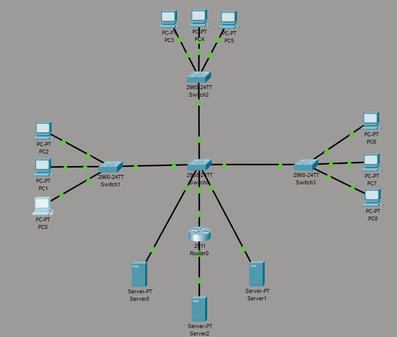

---

### Этап 2: Конфигурирование VLAN на коммутаторах

#### 2.1 Создание VLAN на всех коммутаторах

На каждом коммутаторе (Switch0, Switch1, Switch2, Switch3) были созданы три VLAN через CLI:

```
enable
configure terminal
vlan 10
 name VLAN10
vlan 20
 name VLAN20
vlan 30
 name VLAN30
exit
write
```

#### 2.2 Назначение портов коммутаторов доступа к VLAN

**Switch1 (VLAN 10 – ПК0, ПК1, ПК2):**
```
enable
configure terminal
interface range fa0/1 - 3
 switchport mode access
 switchport access vlan 10
exit
interface fa0/24
 switchport mode trunk
 switchport trunk allowed vlan 10,20,30
exit
write
```

**Switch2 (VLAN 20 – ПК3, ПК4, ПК5):**
```
enable
configure terminal
interface range fa0/1 - 3
 switchport mode access
 switchport access vlan 20
exit
interface fa0/24
 switchport mode trunk
 switchport trunk allowed vlan 10,20,30
exit
write
```

**Switch3 (VLAN 30 – ПК6, ПК7, ПК8):**
```
enable
configure terminal
interface range fa0/1 - 3
 switchport mode access
 switchport access vlan 30
exit
interface fa0/24
 switchport mode trunk
 switchport trunk allowed vlan 10,20,30
exit
write
```

**Switch0 (центральный коммутатор – порты, идущие к роутеру и серверам):**
```
enable
configure terminal
interface fa0/4
 switchport mode access
 switchport access vlan 10
exit
interface fa0/5
 switchport mode access
 switchport access vlan 10
exit
interface range fa0/1 - 3
 switchport mode trunk
 switchport trunk allowed vlan 10,20,30
exit
write
```

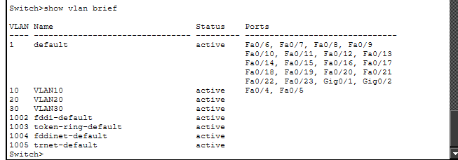

---

### Этап 3: Конфигурирование IP-адресов на конечных устройствах

#### 3.1 Настройка IP на ПК в VLAN 10 и VLAN 20

Для каждого ПК была произведена ручная настройка IP через Desktop → IP Configuration.

**ПК в VLAN 10 (подсеть 192.168.10.0/24):**
- PC0: IP 192.168.10.10, Mask 255.255.255.0, Gateway 192.168.10.1, DNS 192.168.10.253
- PC1: IP 192.168.10.11, Mask 255.255.255.0, Gateway 192.168.10.1, DNS 192.168.10.253
- PC2: IP 192.168.10.12, Mask 255.255.255.0, Gateway 192.168.10.1, DNS 192.168.10.253

**ПК в VLAN 20 (подсеть 192.168.10.0/24):**
- PC3: IP 192.168.10.20, Mask 255.255.255.0, Gateway 192.168.10.1, DNS 192.168.10.253
- PC4: IP 192.168.10.21, Mask 255.255.255.0, Gateway 192.168.10.1, DNS 192.168.10.253
- PC5: IP 192.168.10.22, Mask 255.255.255.0, Gateway 192.168.10.1, DNS 192.168.10.253

#### 3.2 Настройка IP на ПК в VLAN 30

**ПК в VLAN 30 (подсеть 192.168.20.0/24):**
- PC6: IP 192.168.20.30, Mask 255.255.255.0, Gateway 192.168.20.1
- PC7: IP 192.168.20.31, Mask 255.255.255.0, Gateway 192.168.20.1
- PC8: IP 192.168.20.32, Mask 255.255.255.0, Gateway 192.168.20.1

#### 3.3 Настройка IP на серверах

**Server0 (DNS-сервер):**
- IP Address: 192.168.10.253
- Subnet Mask: 255.255.255.0
- Default Gateway: 192.168.10.1

**Server1 (HTTP-сервер):**
- IP Address: 192.168.10.254
- Subnet Mask: 255.255.255.0
- Default Gateway: 192.168.10.1

**Server2 (внешняя сеть / интернет):**
- IP Address: 203.0.113.2
- Subnet Mask: 255.255.255.0
- Default Gateway: 203.0.113.1

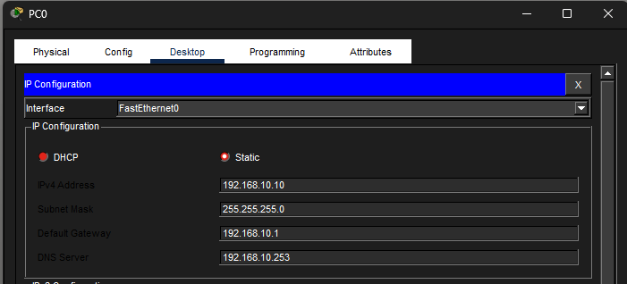

---

### Этап 4: Конфигурирование маршрутизатора

#### 4.1 Настройка интерфейсов маршрутизатора

На Router0 были сконфигурированы интерфейсы для работы с тремя VLAN и WAN-подключением. Использовались сабинтерфейсы для разделения VLAN на одном физическом порту (GigabitEthernet0/0).

**Конфигурация Router0:**

```
enable
configure terminal

! Внутренний интерфейс (trunk к Switch0)
interface g0/0
 no shutdown
exit

! Сабинтерфейс для VLAN 10
interface g0/0.10
 encapsulation dot1Q 10
 ip address 192.168.10.1 255.255.255.0
exit

! Сабинтерфейс для VLAN 20 (на той же подсети)
interface g0/0.20
 encapsulation dot1Q 20
 ip address 192.168.10.1 255.255.255.0
exit

! Сабинтерфейс для VLAN 30 (отдельная подсеть)
interface g0/0.30
 encapsulation dot1Q 30
 ip address 192.168.20.1 255.255.255.0
exit

! Внешний интерфейс (к Server2 / интернету)
interface g0/1
 ip address 203.0.113.1 255.255.255.0
 no shutdown
exit

write
```

После конфигурации проверка:

```
show ip interface brief
```

Результат показал все интерфейсы в состоянии UP/UP.
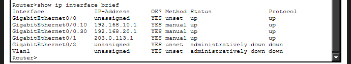

---

### Этап 5: Конфигурирование NAT

#### 5.1 Обозначение внутренних и внешних интерфейсов

На маршрутизаторе был настроен NAT для трансляции внутренних адресов во внешние при выходе в WAN.

```
enable
configure terminal

! Внутренний интерфейс
interface g0/0
 ip nat inside
exit

! Внешний интерфейс
interface g0/1
 ip nat outside
exit
```

#### 5.2 Создание ACL и правила NAT

```
! ACL для разрешения трафика от внутренних сетей
access-list 1 permit 192.168.10.0 0.0.0.255
access-list 1 permit 192.168.20.0 0.0.0.255

! NAT с перегрузкой через внешний интерфейс
ip nat inside source list 1 interface g0/1 overload

exit
write
```

Эта конфигурация позволяет всему трафику из подсетей 192.168.10.0/24 и 192.168.20.0/24 выходить наружу, подменяя свой IP на адрес внешнего интерфейса маршрутизатора (203.0.113.1).

**[Вставить скриншот 5: Конфигурация NAT]**

```
[МЕСТО ДЛЯ СКРИНА - show ip nat statistics или show access-lists]
```

---

### Этап 6: Конфигурирование DNS-сервера

#### 6.1 IP-конфигурация Server0

На сервере Server0 были установлены следующие параметры IP (Config → FastEthernet0):

- IP Address: 192.168.10.253
- Subnet Mask: 255.255.255.0
- Default Gateway: 192.168.10.1

#### 6.2 Включение DNS-сервиса и добавление записей

1. Перейти в **Services → DNS**.
2. Переключатель DNS установлен в положение **ON**.
3. Добавлена запись:
   - **Name:** nasonov.ru
   - **Type:** A (Address Record)
   - **Address:** 192.168.10.254 (IP-адрес HTTP-сервера)

Эта запись позволяет разрешать доменное имя nasonov.ru в IP-адрес внутреннего HTTP-сервера.
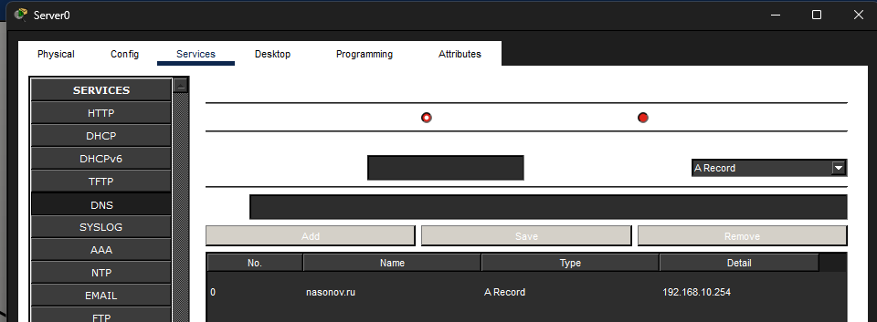  


---

### Этап 7: Конфигурирование HTTP-сервера

#### 7.1 IP-конфигурация Server1

На сервере Server1 были установлены следующие параметры IP (Config → FastEthernet0):

- IP Address: 192.168.10.254
- Subnet Mask: 255.255.255.0
- Default Gateway: 192.168.10.1

#### 7.2 Создание веб-страницы "Об авторе"

1. Перейти в **Services → HTTP**.
2. Включить HTTP-сервис (переключатель **ON**).
3. Отредактировать файл **index.html** со следующим содержимым:

```html
<!DOCTYPE html>
<html lang="ru">
<head>
    <meta charset="UTF-8">
    <title>Об авторе</title>
    <style>
        body {
            font-family: Arial, sans-serif;
            background-color: #f4f4f4;
            margin: 0;
            padding: 20px;
        }
        .container {
            max-width: 800px;
            margin: 0 auto;
            background-color: #ffffff;
            padding: 30px;
            border-radius: 8px;
            box-shadow: 0 2px 4px rgba(0,0,0,0.15);
        }
        h1, h2 {
            text-align: center;
            color: #333333;
        }
        .info {
            margin-bottom: 20px;
        }
        .label {
            font-weight: bold;
        }
        .fact {
            background-color: #e7f3ff;
            border-left: 4px solid #2196F3;
            padding: 10px 15px;
            margin: 8px 0;
        }
        .footer {
            text-align: center;
            margin-top: 30px;
            color: #777777;
            font-size: 14px;
        }
    </style>
</head>
<body>
    <div class="container">
        <h1>Об авторе</h1>

        <div class="info">
            <p><span class="label">ФИО:</span> Насонов Михаил Юрьевич</p>
            <p><span class="label">Группа:</span> 6413 - 10.05.03D</p>
            <p><span class="label">Статус:</span> Студент 4 курса Самарского университета, направление ИБАС (БОИС)</p>
        </div>

        <h2>Интересные факты</h2>

        <div class="fact">
            Увлекаюсь сетевыми технологиями и информационной безопасностью.
        </div>
        <div class="fact">
            Нравится разбираться с лабораторными работами в Cisco Packet Tracer и строить сложные топологии.
        </div>
        <div class="fact">
            Интересуюсь современными киберугрозами и методами защиты информации.
        </div>
        <div class="fact">
            В свободное время прокачиваю навыки в ИТ и изучаю новые технологии.
        </div>

        <div class="footer">
            © 2025 Насонов Михаил Юрьевич
        </div>
    </div>
</body>
</html>
```
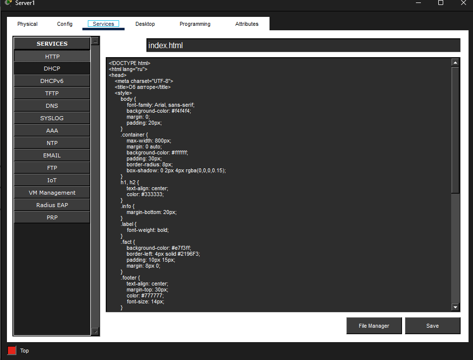


---

### Этап 8: Проверка функционирования сети

#### 8.1 Проверка VLAN и маршрутизации

**Тест 1: Ping между ПК в одной VLAN (VLAN 10)**

На PC0 выполнена команда:
```
ping 192.168.10.11
```

Результат: **успешно** (4 ответа от PC1).

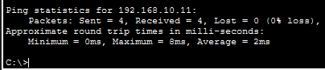


**Тест 2: Ping между ПК в разных VLAN (VLAN 10 → VLAN 30)**

На PC0 выполнена команда:
```
ping 192.168.20.30
```

Результат: **успешно** (4 ответа от PC6), что подтверждает работу маршрутизации между подсетями.

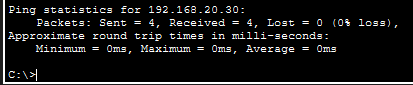

#### 8.2 Проверка HTTP-сервера по IP-адресу

На PC0 открыт Web Browser и введён адрес:
```
http://192.168.10.254
```

Результат: **успешно** — страница "Об авторе" загрузилась корректно.


#### 8.3 Проверка DNS-разрешения имён

На PC0 выполнена команда:
```
nslookup nasonov.ru
```

Результат: **успешно**
```
Server: [192.168.10.253]
Address: 192.168.10.253
Name: nasonov.ru
Address: 192.168.10.254
```

DNS-сервер корректно разрешил доменное имя в IP-адрес HTTP-сервера.

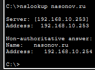

#### 8.4 Проверка HTTP-сервера по доменному имени

На PC0 открыт Web Browser и введён адрес:
```
http://nasonov.ru
```

Результат: **успешно** — страница "Об авторе" загрузилась через резолвинг доменного имени.

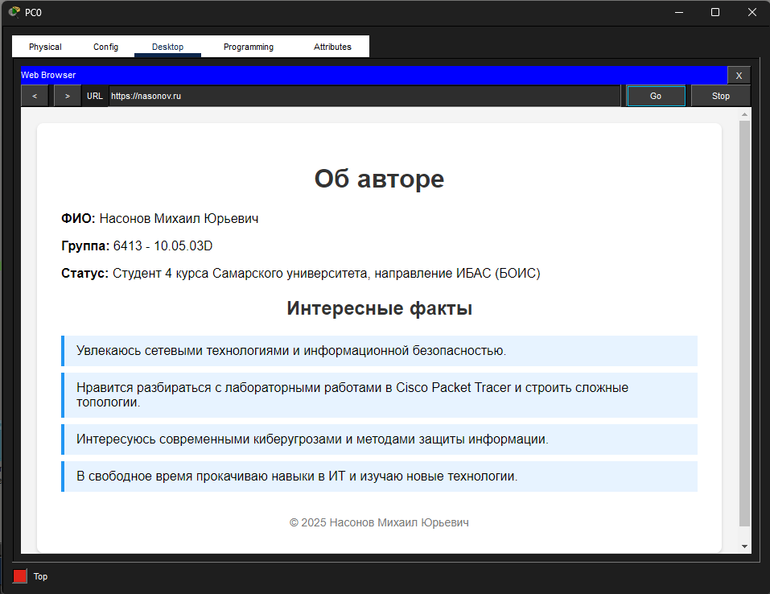

#### 8.5 Проверка NAT

На PC0 открыт Web Browser и произведено подключение к внешнему серверу:
```
http://203.0.113.2
```

Результат: **успешно** — страница внешнего сервера загрузилась, что подтверждает корректную работу NAT и маршрутизации до WAN.

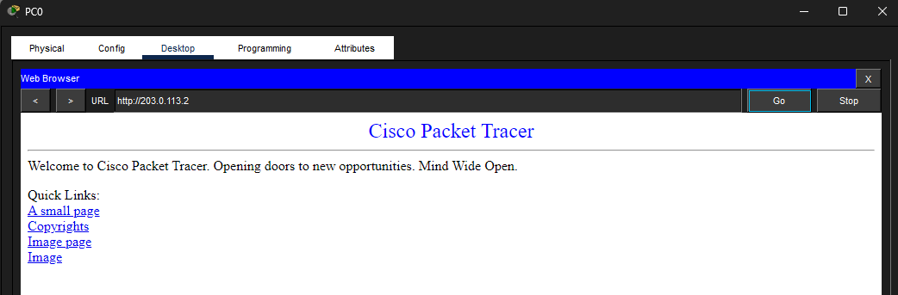

#### 8.6 Проверка таблицы маршрутизации

На Router0 выполнена команда:
```
show ip route
```

Результат показал все необходимые маршруты для подсетей 192.168.10.0/24, 192.168.20.0/24 и 203.0.113.0/24.


---

## Вывод

### Достигнутые результаты

Успешно спроектирована и реализована полнофункциональная корпоративная сеть в среде Cisco Packet Tracer, удовлетворяющая всем требованиям лабораторной работы:

**1. Структура сети:**
- Построена иерархическая топология с центральным коммутатором (Switch0) и тремя коммутаторами доступа (Switch1, Switch2, Switch3).
- Сеть содержит 9 пользовательских хостов (PC0–PC8), распределённых по трём VLAN.
- Подключены два внутренних сервера (DNS и HTTP) и один внешний сервер для представления интернета.

**2. Виртуальные локальные сети:**
- Созданы три VLAN с номерами 10, 20 и 30 на всех коммутаторах.
- VLAN 10 и VLAN 20 функционируют в подсети 192.168.10.0/24.
- VLAN 30 функционирует в отдельной подсети 192.168.20.0/24.
- Все порты коммутаторов доступа корректно назначены соответствующим VLAN.
- Trunk-соединения между коммутаторами настроены для пропуска всех трёх VLAN.

**3. Маршрутизация:**
- На маршрутизаторе Router0 сконфигурированы три сабинтерфейса (VLAN 10, 20, 30) с использованием инкапсуляции 802.1Q.
- Каждому сабинтерфейсу назначены соответствующие IP-адреса и маски подсети.
- Маршрутизация между подсетями работает корректно, ПК из разных VLAN могут обмениваться трафиком.

**4. NAT (Network Address Translation):**
- На маршрутизаторе настроена трансляция адресов с использованием ACL и режима перегрузки (overload).
- Внутренние адреса из подсетей 192.168.10.0/24 и 192.168.20.0/24 преобразуются в адрес внешнего интерфейса (203.0.113.1) при выходе в WAN.
- Проверка показала успешный доступ с ПК во внешнюю сеть (Server2).

**5. DNS-сервис:**
- На Server0 установлена и настроена DNS-служба.
- Добавлена запись типа A для доменного имени nasonov.ru, указывающая на IP-адрес HTTP-сервера (192.168.10.254).
- Тестирование команды nslookup подтвердило корректное разрешение доменного имени.

**6. HTTP-сервис:**
- На Server1 развёрнут HTTP-сервер с персональной веб-страницей "Об авторе".
- Страница содержит информацию об авторе (Насонов Михаил Юрьевич, группа 6413, 4 курс) и интересные факты.
- HTTP-сервер доступен как по IP-адресу (192.168.10.254), так и по доменному имени (nasonov.ru).

**7. Тестирование и верификация:**
- Проведены тесты базовой связности (ping) между ПК в одной VLAN и между ПК в разных VLAN.
- Тесты DNS-разрешения показали корректное преобразование доменного имени.
- Тесты HTTP-доступа по IP и по домену подтвердили корректную работу веб-сервера.
- Проверка маршрутизации через NAT показала успешный выход во внешнюю сеть.

### Практическое значение

Данная лабораторная работа продемонстрировала:
- Глубокое понимание концепции виртуальных локальных сетей и их применения в корпоративных сетях.
- Практические навыки работы с маршрутизацией и сабинтерфейсами для поддержки множества VLAN на одном физическом интерфейсе.
- Применение NAT для обеспечения трансляции адресов и управления доступом к внешним ресурсам.
- Конфигурирование и использование DNS для разрешения доменных имён.
- Развёртывание веб-сервиса и создание контента, доступного по сети.
- Полный цикл проектирования, конфигурирования и тестирования корпоративной сетевой инфраструктуры.

### Заключение

Работа успешно завершена. Спроектированная корпоративная сеть полностью соответствует постановке задачи и демонстрирует наличие всех необходимых компонентов:
- Три виртуальные локальные сети в двух подсетях.
- Статическая маршрутизация между подсетями.
- Трансляция сетевых адресов для управления доступом.
- Функционирующие DNS и HTTP сервисы.
- 9 пользовательских хостов с полной связностью.

Полученные знания и навыки применяются при проектировании и администрировании реальных корпоративных сетей, обеспечивающих надёжное и безопасное взаимодействие между пользователями и сервисами в масштабах больших организаций.

---

## Приложение: Справка по использованным командам

### Команды для конфигурирования VLAN на коммутаторе

```
enable
configure terminal
vlan 10
 name VLAN10
exit
interface fa0/1
 switchport mode access
 switchport access vlan 10
exit
interface fa0/24
 switchport mode trunk
 switchport trunk allowed vlan 10,20,30
exit
write
```

### Команды для конфигурирования маршрутизатора

```
enable
configure terminal
interface g0/0
 no shutdown
exit
interface g0/0.10
 encapsulation dot1Q 10
 ip address 192.168.10.1 255.255.255.0
exit
interface g0/1
 ip address 203.0.113.1 255.255.255.0
 no shutdown
exit
ip nat inside source list 1 interface g0/1 overload
access-list 1 permit 192.168.10.0 0.0.0.255
exit
write
```

### Команды для проверки конфигурации

```
show vlan brief
show ip interface brief
show ip route
show ip nat statistics
show running-config
```

### Команды для тестирования на ПК

```
ping <IP-адрес>
nslookup <доменное имя>
ipconfig (показать текущую конфигурацию)
ipconfig /all (показать детальную информацию)
```

